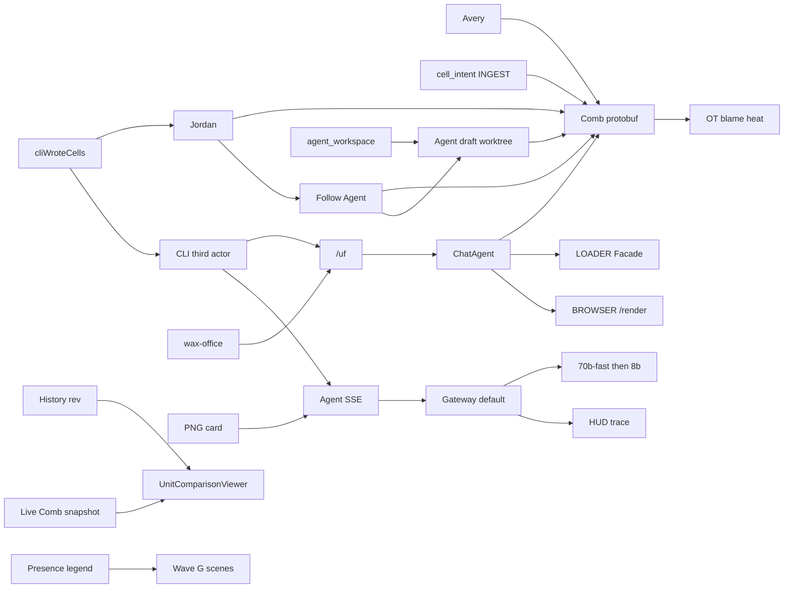

# Production AI + Realtime Collaboration Demo

> **For agentic workers:** REQUIRED SUB-SKILL: `superpowers:subagent-driven-development` + TDD. **T0–T8b and T10–T22 are complete and Approved.** **T9 is in progress** in another agent — do not touch product code, wrangler, `scripts/edge-smoke.mjs`, or T9 files; do not mark T9 complete; do not `git push`. **Wave G (T23–T31) starts after T9 Approved.** **Wave H (T32–T40) also after T9 Approved** and may run alongside Wave G with exclusive-file locks. Subagents: `model: "cursor-grok-4.6-xhigh"` only. Steps use `- [ ]`.
>
> **Save on execute:** copy to [univer-workspace/docs/superpowers/plans/2026-09-11-production-ai-collab-demo.md](univer-workspace/docs/superpowers/plans/2026-09-11-production-ai-collab-demo.md). Ledger: [univer-workspace/.superpowers/sdd/progress.md](univer-workspace/.superpowers/sdd/progress.md). Wave H notes: [univer-workspace/.superpowers/sdd/plan-wave-h-notes.md](univer-workspace/.superpowers/sdd/plan-wave-h-notes.md).
>
> **Revision:** CLI/headless is **on Cloudflare** (agent-think-cordis wax-office `/uf/` contract). Decode every Pro package before editing. Wave F (T15–T22) shipped follow-agent, what-if, screenshot cards, formula inspector, @agent, HUD, undo. **Wave G** composes those primitives into a 2026 sheet instrument. **Wave H** makes `univer-workspace-cli` a Comb-visible third actor (streaming `/agents` SSE, first-class `/uf`, inspect narrative, keep-D3).

**Goal:** [https://univer-workspace.apisos.workers.dev](https://univer-workspace.apisos.workers.dev) is a **pixel-perfect production demo**: Avery + Jordan + Workspace Agent live-edit a Q3 Forecast sheet; DSH/CLI execute/inspect/screenshot/import/export/lint/pdf run **on this Worker**; every beat is live-proved. After T9, Wave G makes the **grid itself** the collaboration log — not another chat overlay. Wave H adds the **CLI as a third collaborator** Avery/Jordan can see (`cliWroteCells`) plus streaming agent turns and a 90s CLI+AI addendum.

**Architecture:** ChatAgent `idFromName("univer_collab")` is the Univer DO. Browser uses Comb protobuf. Agent is Comb member `agent_workspace`. DSH wax-office and `univer-workspace-cli` are thin HTTP clients of `/uf/:fileKey/...`. Execute uses LOADER (or BROWSER `page.evaluate`); screenshot/pdf/lint use `env.BROWSER` + `/render`. Pro `lib/es` is deobfuscated then workerd-adapted. Merge is human. No ComputerAgent containers, no third-party LLM keys. Wave G adds Comb `cell_intent` INGEST, OT blame from History `clientId`, an agent **draft worktree Comb room** Jordan can Follow, Gateway trace on the HUD, and History-vs-live via native `UnitComparisonViewer`. Wave H keeps the packaged CLI off the local daemon on the demo path: `/uf` execute (so `cliWroteCells` fires), `/agents` SSE, and `watch` on the same worktree-events feed Jordan already toasts — the CLI is not a Comb peer.



## Why this is new

A visitor today sees chat chips, a HIT/MISS footer, and Follow Agent on a live Fill. Wave G makes every Q3 cell a live instrument: who is about to write (Comb intent), who last wrote (real History/Comb `clientId` heat, not a PNG), and why E2 is that SUM (inspect + precedents + those writers). The agent drafts on a worktree Comb room Jordan Follows like a human peer **before** merge. Gateway `cf-aig-cache-status` + which llama actually ran is a HUD beat, never a fake MISS. Wave H is the missing third seat: `univer-workspace-cli uf execute` writes E4 through `/uf` so Jordan’s `cliWroteCells` ticker moves; the same CLI streams a Gateway turn (canned `demo:explain-q3` HIT vs ad-hoc skipCache), narrates E2 from inspect precedents, and asks who keeps D3 after a real same-cell conflict — never a fake HIT or PNG. That composition — Comb truth, worktree what-if, native comparison, Gateway cache, **CLI as Comb-visible actor** — does not exist as a two-browser office demo.


**Tech stack:** Workers + DO + D1 + R2 + Workers AI + AI Gateway `default` + Browser Rendering + WorkerLoader, Univer Pro `1.0.0-insiders.20260907-70fc579`, `@univerjs-pro/live-share` same pin, React 19 Browser, Cordis 4.0.2, pnpm 11.

## Do not redo

Prior plan wired Skills, HTTP turns, snapshot/changeset HTTP, Worktree clone/merge, `enableOfflineEditing: false`. Presets already registered: sheets advanced, CF, thread comment, notes, history UI, collaboration client UI, [collaborator-avatars.tsx](univer-workspace/apps/workspace/web/src/features/editor/collaborator-avatars.tsx) **exists**. Dark-mode sync exists.

## Out of scope

- Two Univer canvases in one tab
- Confetti, sound, particle overlays, canvas coach overlay
- Docs/Slides as the hero (sheet is the demo)
- `gpt-oss-120b` on the live path
- ComputerAgent Docker, Design Studio copy, BYOK
- Channel 1 mux OT, fake agent Comb ticket, AI Gateway WebSockets
- Importing `collaboration-transport-node` or `exchange-node-binding` into workerd
- Changing CLI `DEFAULT_ORIGIN` (`workspace.univer.plus`) except README fork notes
- Replacing live Fill E2:E4 (T5/T17) with draft-only writes — Wave G **adds** Draft Fill; live Fill stays
- Automatic worktree merge (merge stays human)
- Voice, 3D, blockchain, extra LLM models, AI Gateway WebSockets

**Wave G scope change (accepted 2026-09-12):** T26 may add **worktree Comb** upgrade on `dsh-host.ts` for `/universer-api/worktrees/:worktreeId/comb/connect` so `agent_workspace` is a real peer on the draft room. This is not a fake Comb ticket, not two Univer canvases in one tab, and not Channel 1 mux OT. T20’s HUD already regexes that URL; the DO does not accept it yet. Do not fake Follow on the trunk sheet.

## Global constraints

- Branch `feat/cloudflare-edge-microkernel` only. Product git: `univer-workspace/`.
- Subagents: `**model: "cursor-grok-4.6-xhigh"` only.** No `fast`.
- Decode first: [scripts/deobfuscate-univer-pro.mjs](univer-workspace/scripts/deobfuscate-univer-pro.mjs). Patch `vendor/univer-pro/<pkg>/lib/es/**` or `dist/*.mjs`. Never `umd/`, never pnpm store, never `_0x` blobs. Re-run after `pnpm install`.
- Comb: `HELLO=1 JOIN=2 LEAVE=3 INGEST=4 HEARTBEAT=5 RECV=6`, `CmdRspCode.OK=1`. Unknown INGEST `eventID` broadcast as-is.
- Gateway `id: "default"`, account `e4a1e871f7728c7d65d6da135db01658`. Metadata **≤5 keys**: `product`, `unitId`, `turnId`, `actorUserId`, `step`.
- Tools: `stream: false`, `skipCache: true`. Final text: `stream: true` **without** `tools`. Explain Q3: `skipCache: false`, `cacheKey: "demo:explain-q3"`, `cacheTtl: 3600`.
- Models: `@cf/meta/llama-3.3-70b-instruct-fp8-fast` then `@cf/meta/llama-3.1-8b-instruct`.
- `AGENT_MEMBER_ID = AGENT_USER_ID = "agent_workspace"`. Gateway `actorUserId` = prompting human.
- One in-flight turn per `unitId`. After Comb SYNCED, **no** local `setValue` in [apply-agent-edits.ts](univer-workspace/apps/workspace/web/src/features/editor/apply-agent-edits.ts).
- `enableOfflineEditing: false`. `loadSheetAsync` only.
- Live: `https://univer-workspace.apisos.workers.dev`. Avery `admin`/`password123`. Jordan `jordan`/`password123`.
- `dsh-host.ts` sequential: T1 → T3 → T10 → T13b. Wave G **T26 only** after T9 Approved (worktree Comb path). `server.ts`: T2 owns `Env.AI` + `/healthz.ai`; T13a adds BROWSER/LOADER + `/uf` forward after T2. Wave G does not take `server.ts`.
- [catalog.ts](univer-workspace/src/kernel/catalog.ts) unfrozen **only** for T13g.
- Conventional Commits. Do not weaken tests. Exclusive ownership: BLOCKED if you do not own the file.
- Reduced motion: `prefers-reduced-motion: reduce` skips spotlight walk (chip only). Wave G: no thinking pulse, no blame shimmer, intent rings static.
- Wave G pixel bar: typography `text-[11px]`/`h-9` header chips, presence rings on the six tokens, ghost Jordan dashed, HUD never shows HIT/MISS/protobuf until observed, comparison labels use History names, no English leftovers (`Present`/`Stop`/`precedents`/`Q3 Forecast` title), no fake PNG, no fake HIT. i18n `en-US` + `zh-CN` for every new string.
- Wave G Linux shells: `required_permissions: ["all"]` (sandbox cannot unshare user namespaces on this host).
- `i18n.tsx`: Wave G and Wave H tasks may **append-only** keys; do not reformat the file; do not rewrite unrelated strings.
- Wave H Linux shells: `required_permissions: ["all"]`. Wave H does not take `dsh-host.ts`. Wave H does not take `univer-agent.ts` until T27 Approved (prefer new files even then). Wave H does not take `server.ts`, wrangler, or T9/T31 smoke.
- Wave H pixel bar (T39): same as Wave G — `text-[11px]`/`h-9`, i18n `en-US` + `zh-CN`, Avery Chen / Jordan Lee / Workspace Agent, no English leftovers, no fake HIT/PNG. CLI terminal copy may be English.

### Exclusive ownership (locks)

- **T0:** deobfuscate script `DEFAULT_PACKAGES`, `vendor/univer-pro/`** decode trees, vendor README. No behavior patches.
- **T1:** create [univer-comb-codec.ts](univer-workspace/src/integrations/univer-comb-codec.ts), Comb in [dsh-host.ts](univer-workspace/src/project/dsh-host.ts), [univer-comb-codec.test.ts](univer-workspace/test/univer-comb-codec.test.ts). Optional decoded `collaboration-client` socket after T0.
- **T2:** [univer-agent.ts](univer-workspace/src/plugins/univer-agent.ts), `server.ts` AI/`healthz.ai` only, agent tests, [edge-deploy-contract.test.ts](univer-workspace/test/edge-deploy-contract.test.ts) AI assertions only.
- **T3:** broadcast/cursor/roster in `dsh-host.ts`; `clientId` in agent `executeTool`; apply-agent-edits; collab tests.
- **T4:** [schema.ts](univer-workspace/src/control-plane/schema.ts), create [univer-demo-snapshot.ts](univer-workspace/src/plugins/univer-demo-snapshot.ts), [demo-seed.test.ts](univer-workspace/test/demo-seed.test.ts). Name `**ensureDemoData`**. Skip if any A1:E4 non-empty.
- **T5:** agent-collaborator, agent-panel, create agent-edit-spotlight, i18n, tests.
- **T6:** workspace `package.json` live-share, collaboration-editor, sheet-presets, create live-share-bar + collab-conflict-toast.
- **T7:** snapshot-comparison-view, worktree-review-panel; import comparison `styles.css` **in the view**.
- **T8a:** layout, login, create demo routes/stage/playbook/palette/scenes. **Do not** autofill password.
- **T8b:** collaborator-avatars (**edit**), presence-legend, history names, remaining i18n.
- **T10:** create univer-comment-http.ts; comment + user/list in univer-collab-http.ts. Decoded comment Pro after T0.
- **T11:** control-plane `/api/auth/cli/`* only.
- **T12:** [univer-snapshot.ts](univer-workspace/src/plugins/univer-snapshot.ts) + decoded collab-service apply.
- **T13a:** [wrangler.jsonc](univer-workspace/wrangler.jsonc) browser/loader/`/uf` in `run_worker_first`; Env types; deploy-contract bindings (after T2).
- **T13b:** create [univer-file-http.ts](univer-workspace/src/integrations/univer-file-http.ts) + `dsh-host` `/uf` dispatch + `server.ts` `/uf` forward.
- **T13c:** inspect handlers + tests.
- **T13d:** execute + render-evaluate/LOADER; depends T12 + T13e page stub.
- **T13e:** create render entry + screenshot/pdf/lint.
- **T13f:** import/export/svg + R2.
- **T13g:** create [univer-file.ts](univer-workspace/src/plugins/univer-file.ts) + catalog row.
- **T14:** client-core HTTP, [cli-edge-proof.mjs](univer-workspace/scripts/cli-edge-proof.mjs).
- **T15–T22:** files named in those tasks; do not take `dsh-host.ts` except T20 ticker if feed already exists (prefer header-only). **Shipped — do not reopen.**
- **T9:** `scripts/edge-smoke.mjs`, `test/edge-smoke.test.ts`, wrangler deploy, runbook. **In flight — do not touch.**
- **T23:** [live-share-bar.tsx](univer-workspace/apps/workspace/web/src/features/editor/live-share-bar.tsx), [presence-roster.ts](univer-workspace/apps/workspace/web/src/features/editor/presence-roster.ts), [formula-inspector-popover.tsx](univer-workspace/apps/workspace/web/src/features/demo/formula-inspector-popover.tsx) (i18n dts only), [agent-panel.ts](univer-workspace/apps/workspace/web/src/features/editor/agent-panel.ts) (`gatewayCacheStatus` honesty only), [agent-collaborator.tsx](univer-workspace/apps/workspace/web/src/features/editor/agent-collaborator.tsx) title + unknown cache footer. Append i18n keys. Releases `agent-panel.ts`, `agent-collaborator.tsx`, and the popover after Approved.
- **T24:** create `cell-presence-intent.ts` + `sheet-range-highlight.ts` + tests; [follow-agent-collab-socket.ts](univer-workspace/apps/workspace/web/src/features/editor/follow-agent-collab-socket.ts) tap-only. **Do not take `dsh-host.ts`** (T1 already RECV-broadcasts unknown INGEST).
- **T25:** create `ot-blame-heat.ts` + test. Consumes T24 highlight helper. Does not take `dsh-host.ts` / `univer-file-http.ts` (History `/cs` + live Comb).
- **T26:** **exclusive `dsh-host.ts` after T9 Approved** — worktree Comb path **only** (do not retouch live `/universer-api/comb/connect`, comments, `/uf`). Create `demo-agent-draft.ts` + test. [follow-agent.ts](univer-workspace/apps/workspace/web/src/features/editor/follow-agent.ts) draft target. Do not take `demo-palette.ts` (T30 wires the chip).
- **T27:** [univer-agent.ts](univer-workspace/src/plugins/univer-agent.ts) trace fields on `agent.done`; [edge-hud.ts](univer-workspace/apps/workspace/web/src/features/demo/edge-hud.ts); [edge-status-strip.tsx](univer-workspace/apps/workspace/web/src/features/demo/edge-status-strip.tsx); create `gateway-trace.ts`. After T23: [agent-collaborator.tsx](univer-workspace/apps/workspace/web/src/features/editor/agent-collaborator.tsx) footer. Do not take `server.ts`.
- **T28:** create `history-vs-live.ts` + test; [snapshot-comparison.ts](univer-workspace/apps/workspace/web/src/features/worktrees/snapshot-comparison.ts) labels only; [snapshot-comparison-view.tsx](univer-workspace/apps/workspace/web/src/features/worktrees/snapshot-comparison-view.tsx) History vs Live labels. Do not take `dsh-host.ts`. Do not add a second Univer editor canvas.
- **T29:** [formula-inspector.ts](univer-workspace/apps/workspace/web/src/features/demo/formula-inspector.ts), [formula-inspector-popover.tsx](univer-workspace/apps/workspace/web/src/features/demo/formula-inspector-popover.tsx), tests. After T23 popover + T25 blame API.
- **T30:** [presence-legend.tsx](univer-workspace/apps/workspace/web/src/features/editor/presence-legend.tsx), [collaborator-avatars.tsx](univer-workspace/apps/workspace/web/src/features/editor/collaborator-avatars.tsx), [demo-playbook.ts](univer-workspace/apps/workspace/web/src/features/demo/demo-playbook.ts), [demo-playbook-bar.tsx](univer-workspace/apps/workspace/web/src/features/demo/demo-playbook-bar.tsx), [demo-scenes.ts](univer-workspace/apps/workspace/web/src/features/demo/demo-scenes.ts), [demo-search.ts](univer-workspace/apps/workspace/web/src/features/demo/demo-search.ts), [demo-palette.ts](univer-workspace/apps/workspace/web/src/features/demo/demo-palette.ts), [demo-runtime.tsx](univer-workspace/apps/workspace/web/src/features/demo/demo-runtime.tsx). After T24–T29 functions exist.
- **T31:** create `scripts/edge-wave-g.mjs` + `test/edge-wave-g.test.ts`. **Do not edit `scripts/edge-smoke.mjs` until T9 Approved.** After T9 Approved, T31 may **append** Wave G beats without deleting T9 assertions.
- **T32:** [univer-file.ts](univer-workspace/packages/client-core/src/univer-file.ts), create `apps/cli/src/features/edge/uf-command.ts` + `apps/cli/src/features/edge/index.ts`; [program.ts](univer-workspace/apps/cli/src/program.ts) **one-line** `registerEdgeCommands` only. Do not change `DEFAULT_ORIGIN`. Do not take `dsh-host.ts` / `univer-file-http.ts` / daemon execute.
- **T33:** [http.ts](univer-workspace/packages/client-core/src/http.ts) `Accept` header; [agent.ts](univer-workspace/packages/client-core/src/agent.ts); create `agent-sse.ts`; `apps/cli/src/features/edge/agent-command.ts`. **Do not take `univer-agent.ts`.** After T32 `edge/index.ts`.
- **T34:** create `packages/client-core/src/change-feed.ts`; [live-edit.ts](univer-workspace/apps/agent/src/live-edit.ts); [workspace-change-feed.ts](univer-workspace/apps/agent/src/workspace-change-feed.ts); `watch-command.ts`. **Do not take `dsh-host.ts`.** Keep `--via collab` default.
- **T35:** `packages/client-core/src/agent-actions.ts`; T33 `agent-command.ts` undo/follow. Do not take Live Share bar.
- **T36:** create `packages/client-core/src/agent-draft.ts`. **After T26 Approved.** Do not take `dsh-host.ts` or `demo-agent-draft.ts`.
- **T37:** create `packages/client-core/src/cell-narrative.ts`. Do not take `formula-inspector.ts` (T29).
- **T38:** create `demo-conflict-keep.ts` + `packages/client-core/src/conflict-keep.ts`. Do not take `univer-agent.ts` or `collab-conflict-toast.ts`. Bind in T39 after T30/T24.
- **T39:** demo-search/scenes/palette/runtime **after T30 Approved** (append scene union). i18n append-only.
- **T40:** create `scripts/edge-wave-h.mjs` + `test/edge-wave-h.test.ts`. **Do not edit `scripts/edge-smoke.mjs` or `scripts/edge-wave-g.mjs`.**

Do not expand [worker-gateway.test.ts](univer-workspace/test/worker-gateway.test.ts) except `/uf` forward cases owned by T13b.

## `/uf/` contract (WaxGatewayClient)

Source of truth: [agent-think-cordis wax-office/client.ts](/home/gabriel/Documentos/agent-think-cordis/src/plugins/wax-office/client.ts). `fileKey` = base64url of a path. Demo: `workspace.univer` → Space holding `unit_welcome_sheet`.

Export `fileKeyOf` / `spaceIdFromFileKey` in univer-file-http.ts:

```ts
export function spaceIdFromFileKey(key: string): string {
  const path = atob(key.replace(/-/g, "+").replace(/_/g, "/"));
  return `space_uf_${[...new Uint8Array(new TextEncoder().encode(path))]
    .map((b) => b.toString(16).padStart(2, "0"))
    .join("")
    .slice(0, 24)}`;
}
```

Routes (auth = `workspace_session` or CLI token; 401 otherwise):

- `POST /uf/:key` ensure Space
- `GET /uf/:key/units`
- `POST /uf/:key/universer-api/snapshot/:type/unit/-/create`
- `GET|POST /uf/:key/worktrees`
- `GET|POST /uf/:key/worktrees/:id/units`
- `POST /uf/:key/worktrees/:id/units/:unitId/remove`
- `POST /uf/:key/worktrees/:id/{ready|reopen|merge|discard}`
- `GET /uf/:key/worktrees/:id/preview`
- `GET /uf/:key/units/:unitId/inspect?range=&worktreeId=`
- `POST /uf/:key/worktrees/:wt/units/:unitId/execute` `{ code }`
- `POST /uf/:key/import` `{ format, content, worktreeId? }`
- `POST /uf/:key/export` `{ unitId, format, worktreeId? }`
- `POST /uf/:key/lint` `{ unitId, worktreeId? }`
- `POST /uf/:key/screenshot` `{ unitId, params? }` → `{ images: [{ mediaType: "image/png", data, width, height }] }`
- `POST /uf/:key/print-pdf`
- `POST /uf/:key/compile-svg` `{ unitId, svg }`
- `GET /resources?q=`

## CF runtimes (do not invent Node daemons)

- **inspect:** DO snapshot (`getSheetRange`). Calculated `v` only after execute persisted `{ f, v }`.
- **execute:** Facade in LOADER worker (`nodejs_compat` + decoded presets) **or** BROWSER `page.evaluate` on `/render`. Commit via collab `applyChangeset`. `memberId` = caller (CLI human) unless Agent invoked the tool (`agent_workspace`).
- **screenshot/pdf/lint:** `env.BROWSER` loads `/render?unitId=&worktreeId=&theme=`. CDP capture. R2 + data URI.
- **import/export:** decoded `exchange-client` inside BROWSER. Bytes R2.
- **compile-svg:** pure JS in DO (DSH `compileSvg`).
- **formula:** `api.getFormula().executeCalculation()` in that Univer instance; persist `{ f, v }`.

Wrangler (T13a):

```jsonc
"browser": { "binding": "BROWSER", "remote": true },
"worker_loaders": [{ "binding": "LOADER" }]
```

`cpu_ms: 300000` and `nodejs_compat` already exist.

---

### T0: Deobfuscate Pro for Cloudflare

**Files:** [deobfuscate-univer-pro.mjs](univer-workspace/scripts/deobfuscate-univer-pro.mjs), [vendor/univer-pro/README.md](univer-workspace/vendor/univer-pro/README.md), vendor trees.

**Produces:** readable `vendor/univer-pro/<pkg>/lib/es` for the CF set. No OT/formula behavior change yet.

CF set: `collaboration`, `collaboration-client`, `collaboration-client-ui`, `collaboration-endpoint`, `collaboration-service`, `collaboration-database-sqlite`, `collaboration-worktree-client`, `collaboration-worktree-endpoint`, `collaboration-worktree-service`, `collaboration-worktree-database-sqlite`, `collaboration-comment-endpoint`, `collaboration-comment-service`, `collaboration-comment-database-sqlite`, `collaboration-history-endpoint`, `collaboration-history-service`, `collaboration-history-database-sqlite`, `thread-comment-datasource`, `sheets-history`, `sheets-history-ui`, `docs-history`, `docs-history-ui`, `edit-history`, `edit-history-ui`, `live-share`, `engine-formula`, `exchange-client`, `docs-exchange-client`, `slides-exchange-client`, `bases-exchange-client`, `exchange-node`, `sheets-print`, `docs-print`, `slides-print`, `boards-print`, `license`. Decode `collaboration-transport-node` to **read** only.

Do **not** vendor-apply rust-binding or `exchange-node-binding` into the Worker.

- [ ] Failing test: `DEFAULT_PACKAGES` includes `engine-formula` and `exchange-client` (extend [deobfuscate-univer-pro.test.mjs](univer-workspace/scripts/deobfuscate-univer-pro.test.mjs)).
- [ ] Expand `DEFAULT_PACKAGES`; run `node scripts/deobfuscate-univer-pro.mjs` then `--fix-vendor`.
- [ ] Assert no glued `returnawait` in `vendor/univer-pro/engine-formula/lib/es` (or skip file with comment if decoder cannot; then fix decoder — do not patch CJS).
- [ ] README: decode → edit vendor → apply → never published.
- [ ] Commit `chore(vendor): deobfuscate Univer Pro packages needed on Cloudflare`

Workerd adaptations happen in T1/T10/T12/T13d–f: swap `better-sqlite3`/`worker_threads`/`node:fs` for DO SQL / D1 / R2; hydrate `cellData`; JS formula; exchange/print in BROWSER.

---

### T1: Comb protobuf + INGEST

**Produces:** `decodeCombFrame(bytes | string)`, `encodeCombFrame(msg) → Uint8Array`, `encodeCombJson(msg) → string`.

- [ ] Failing tests: HELLO/JOIN/RECV `users_enter` / `new_changesets` binary roundtrip; JSON still decodes; opaque `eventID: "live_share"` INGEST RECV-broadcast to second fake socket.
- [ ] Codec via `@univerjs/protocol` (inspect node_modules; do not invent field numbers).
- [ ] Dual-path `webSocketMessage`: `ArrayBuffer` → protobuf; JSON `cmd` stays JSON unless `att.wire === "protobuf"`. Set `att.wire` on first binary frame.
- [ ] INGEST: `update_cursor` current shape; **any other eventID** RECV as-is.
- [ ] Commit `feat(collab): speak official protobuf Comb and pass through Live Share INGEST`

---

### T2: AI Gateway + live SSE

Widen `Env.AI` / `AgentHost.env` to 3-arg `run`. Prefer `wrangler types` `Ai`.

```ts
export const AI_GATEWAY_ID = "default";
export const AI_GATEWAY_LIVE_MODELS = [
  "@cf/meta/llama-3.3-70b-instruct-fp8-fast",
  "@cf/meta/llama-3.1-8b-instruct",
] as const;
```

`emit()` is a **live sink** (SSE write / mux send), not fill-then-dump.

- [ ] Tests: `gateway.id === "default"`; tool still writes; **final** `run` has `stream: true` and **no** `tools`; mock SSE `data: {"response":"Hel"}\n\n`; tokens Hel/lo; explain uses `skipCache: false` + `cacheKey: "demo:explain-q3"`; tools `skipCache: true`; `/healthz.ai.gateway === "default"`.
- [ ] Metadata 5 keys, `step: "tool" | "text" | "explain"`.
- [ ] `Accept: text/event-stream` writes immediately; JSON default for CLI.
- [ ] Mux: `muxFrame` **per emit**. `{ ch: 2, channel: 2, type, data }`.
- [ ] Busy lock per `unitId` → `agent.error` “Agent is busy”.
- [ ] Snapshot `aiGatewayLogId` onto `agent.done`.
- [ ] Commit `feat(agent): route inference through AI Gateway default with live SSE`

---

### T3: Agent Comb peer

**Depends on T1.** Identity: `userID = memberID = "agent_workspace"`, `name = "Workspace Agent"`. **No ticket.**

- [ ] `getRoomMembers` appends agent when room has ≥1 human. JOIN `joinRsp` includes it. Broadcast `users_enter` on first JOIN.
- [ ] Sheet writes `clientId: AGENT_MEMBER_ID`.
- [ ] Each `setRange`: Comb `update_cursor` (A1 → row/col) **then** `new_changesets`. Encode per `att.wire`.
- [ ] `applyWorkspaceAgentEdits`: if `SYNCED`, do not `setValue`; return `{ applied: false, ranges }`.
- [ ] Test: second member gets `users_enter` + `update_cursor` + `new_changesets` (`sheet.mutation.set-range-values`).
- [ ] Skip `users_leave` if it races the demo.
- [ ] Commit `feat(collab): show Workspace Agent as a Comb collaborator with cursor`

---

### T4: Q3 Forecast seed

**Ids locked:** `user_admin` Avery Chen; `user_jordan` Jordan Lee `editor` on `space_personal_admin`; `node_welcome_sheet` / `unit_welcome_sheet`. Rename node **Q3 Forecast**.

Bake into `originalMeta` (not live Facade after load):

- Sheet `Forecast`
- Header `Metric | Jul | Aug | Sep | Q3`
- B2:D4 sample numbers; **E2:E4 empty** (Agent fill beat) with color scale already on E2:E4
- Sparklines F2:F4 from `B2:D2`…
- Column chart `A1:D4` below table
- Named range `Sep` = `D2:D4`
- Data validation 0–999 on `D2:D4`

`ensureDemoData(db)`: idempotent; add Jordan; **do not apply snapshot if any A1:E4 non-empty**.

- [ ] Tests: two users; no dup; snapshot has CF or chart drawing; named range `Sep`.
- [ ] Commit `feat(demo): seed Avery, Jordan, and a charted Q3 Forecast`

---

### T5: Agent panel stream + spotlight

- [ ] SSE client (`Accept: text/event-stream`); JSON fallback.
- [ ] `aria-live="polite"`; `aria-busy`; tool chips; tokens.
- [ ] Footer: `Cloudflare AI Gateway` + `cache: HIT|MISS` + truncated `aiGatewayLogId`.
- [ ] Chips: `Fill E2:E4 with SUM of Jul–Sep`, `Explain the Q3 forecast in one sentence`, `Set D4 to 180`. Header title `Q3 Forecast` (hide unit id).
- [ ] Spotlight: `workspace-agent-edited` → `activate()` E2→E4 once (`sessionStorage` `univer-workspace-agent-replay-v1`). Replay button. Compact 720 **and** `prefers-reduced-motion`: chip only.
- [ ] Dispatch `workspace-agent-presence` `{ status: "thinking" | "idle" }`.
- [ ] Spectator mux listen-only; never send `agent.prompt` from spectators.
- [ ] i18n: `agentGateway`, `agentCacheHit`, `agentCacheMiss`, `agentChangedCells`, `agentReplay`, `agentChipFillQ3`, `agentIntro`.
- [ ] Commit `feat(web): stream Gateway turns with cell spotlight`

---

### T6: Live Share + conflict

- [ ] `@univerjs-pro/live-share@1.0.0-insiders.20260907-70fc579` + CSS + `/facade`. Register `UniverLiveSharePlugin`. `UniverSheetsThreadCommentPreset({ collaboration: true })`.
- [ ] `live-share-bar.tsx`: Present / Stop / Follow via Facade. Hide if missing.
- [ ] `CollaborationUIEventId.CONFLICT` → Sonner warning, debounce 800ms. i18n `collabConflictToast`.
- [ ] Move custom status pill **off canvas** into node header.
- [ ] Commit `feat(web): Live Share present/follow and collab conflict toasts`

---

### T7: Native comparison viewer

- [ ] Mount `UnitComparisonViewer` / `createComparisonUniver`.
- [ ] Import `@univer/unit-comparison-viewer/styles.css` **in the view file** (not `global.css`).
- [ ] `left.label` / `right.label` (`officialVersion` / `agentVersion`).
- [ ] HTML table fallback if factory throws.
- [ ] Commit `feat(web): native Worktree unit comparison`

---

### T8a: `/demo` stage + scenes + palette

**Do not** fill password. **Do not** overlay coach on the grid.

- [ ] Routes `/demo`, `/demo?as=jordan`, `/demo?lang=zh-CN`, `/demo?play=1`, `/demo?scene=fill|conflict|review|export`. Silent POST login → `/nodes/node_welcome_sheet?play=1`. Hide Create account on this origin.
- [ ] Header stepper `h-9`: Open Jordan → Edit a cell → Ask Agent Fill → Present/Follow → Worktree Ready/Compare/Merge. `localStorage` `univer-workspace-demo-playbook-v2`. Compact: `Demo` badge only. Keys `j`/`n` advance step when playbook focused.
- [ ] Scenes: `fill` focuses Fill chip; `conflict` copies Jordan URL + toast `collabSameCell`; `review` opens worktree panel; `export` opens palette export.
- [ ] ⌘K palette: Avery/Jordan links, Fill SUM, Explain Q3, Present, Follow Agent (T15), What-if (T18), Export xlsx (T13f), language.
- [ ] Safe reset: other humans → `demoResetBlocked` + isolate; alone → T4 empty A1:E4 rule. No wipe endpoint.
- [ ] Commit `feat(web): presenter /demo stage, scenes, and command palette`

---

### T8b: Presence + History names

- [ ] Avatars: ring from `member.color` or hash `userID` onto tokens `brand-600`, `sheet`, `board`, `slide`, `warning`, `baseunit`. Empty: you + dashed **Waiting for Jordan** + muted Bot. Pulse on thinking. Bot icon if `userID === "agent_workspace"` or `agent:`.
- [ ] `presence-legend.tsx` popover on the stack (not a HUD on the grid).
- [ ] History map: `user_admin` → Avery Chen, `user_jordan` → Jordan Lee, `agent_workspace` → Workspace Agent. Stop `Administrator`.
- [ ] i18n: `collaborationExample` → `Humans and AI, live` / `人与 AI 实时协作`. Playbook + palette keys.
- [ ] Commit `feat(web): presence rings, ghost Jordan, and History names`

---

### T10: Comments or notes

Copy wire from `@univerjs-pro/collaboration-comment-endpoint` (decoded after T0). SQLite on ChatAgent. `/universer-api/comment/unit/:unitId/...` + `GET /universer-api/user/list` (Avery, Jordan, Agent).

- [ ] Test: comment D3, list returns it, second member sees it.
- [ ] If wire mismatches: **hide** comment chrome (no 404 button); notes fallback if OT materialize works.
- [ ] Commit `feat(collab): Universer thread comments for the Q3 demo` **or** `fix(web): hide thread comments until Universer comment routes exist`

---

### T11: CLI device-code

[auth.ts](univer-workspace/packages/client-core/src/auth.ts) already calls `POST /api/auth/cli/authorizations` and `/exchange`. SPA [cli-login.tsx](univer-workspace/apps/workspace/web/src/routes/cli-login.tsx) exists.

- [ ] Failing test: start → approve as `user_admin` → exchange cookie/token; expired 401; password-stdin still works.
- [ ] D1 `cli_authorizations (user_code, user_id, status, expires_at)`.
- [ ] No CLI poll; `--complete` one-shot.
- [ ] Commit `feat(edge): device-code CLI login against the Cloudflare origin`

---

### T12: Materialize mutations

- [ ] Failing tests from real mutation JSON: `{ v, f: "=SUM(B2:D2)" }` persists both; insert-row/col if Facade emits them; unknown id stored, snapshot not corrupted.
- [ ] Apply via **decoded** `collaboration-service` helpers, not a third mutator. Keep `projectSheetBlocks`. Patch decoded `collaboration-client` hydrate if `loadSheetAsync` drops `cellData`.
- [ ] Commit `fix(edge): apply Facade mutations onto collaborative snapshots`

---

### T13a: Bindings

- [ ] Failing `edge-deploy-contract`: `browser.binding === "BROWSER"`, `worker_loaders[0].binding === "LOADER"`, `run_worker_first` includes `/uf` and `/uf/*`.
- [ ] Implement wrangler keys; extend `Env` (`BROWSER`, `LOADER`). Do not steal T2 healthz.
- [ ] Commit `feat(edge): bind Browser Rendering and WorkerLoader`

---

### T13b: `/uf` router

- [ ] Failing tests: unauthenticated POST 401; `POST /uf/:key` then `GET .../units` 200; unknown key 404.
- [ ] `handleUniverFileHttp` + forward from `server.ts` + `dsh-host.fetch`. Map fileKey → Space (create on POST).
- [ ] Alias existing worktree product APIs under `/uf/:key/worktrees`.
- [ ] Commit `feat(edge): Univer File /uf gateway skeleton`

---

### T13c: inspect

- [ ] Failing test: seed A1, `GET .../inspect?range=A1` returns `{ v }` (or grid).
- [ ] Implement from DO snapshot. Worktree query uses draft snapshot.
- [ ] Commit `feat(edge): /uf inspect from collaborative snapshots`

---

### T13d: execute

**Depends on T12 + `/render` stub from T13e.**

- [ ] Failing test: POST `{ code: "api.getActiveWorkbook().getActiveSheet().getRange('E2').setValue({ f: '=SUM(B2:D2)' });" }` → inspect shows `f` and/or `v`. Fake BROWSER/LOADER in unit tests.
- [ ] Real Facade (LOADER or `page.evaluate`). Persist changeset. Formula `executeCalculation()`.
- [ ] Writes use caller memberId (not agent) for CLI.
- [ ] Commit `feat(edge): /uf execute Facade on Cloudflare`

---

### T13e: render + screenshot/pdf/lint

**Files:** create `apps/workspace/web/src/render-main.tsx` (minimal Univer boot, no chrome), Vite entry, asset `/render`.

- [ ] Failing tests: fake BROWSER `Page.captureScreenshot` → PNG length > 0; missing BROWSER → 503 `{ error: "BROWSER unbound" }` (never fake pixels).
- [ ] `/render?unitId=&worktreeId=&theme=` loads snapshot, exposes `window.univerAPI`.
- [ ] screenshot / print-pdf / lint routes.
- [ ] Commit `feat(edge): Browser Rendering screenshots and print-pdf`

---

### T13f: exchange + svg

- [ ] Failing tests: import tiny csv → unit exists; export `csv` returns bytes; svg compile mutates snapshot.
- [ ] Decoded `exchange-client` in BROWSER; R2 for blobs. No `exchange-node-binding`.
- [ ] Commit `feat(edge): /uf import export and compile-svg on Cloudflare`

---

### T13g: Cordis `univer_*` tools

- [ ] Catalog plugin `univer-file`. Tools: `univer_execute`, `univer_inspect`, `univer_screenshot`, `univer_import`, `univer_export`, `univer_lint`, `univer_print_pdf`, `univer_compile_svg`, `univer_worktree`, `univer_unit` — same names as wax-office.
- [ ] Agent turns may call `univer_execute` (not only regex `Set A1`). Regex remains fallback.
- [ ] Commit `feat(agent): DSH office tools on ChatAgent`

---

### T14: Thin CLI proof

CLI execute/inspect/screenshot/import/export against `EDGE_ORIGIN` **must** hit `/uf/`. Local Chromium not required for exit 0.

- [ ] `scripts/cli-edge-proof.mjs` live-true: login, whoami, space list, execute SUM E2, inspect E2, screenshot PNG>0, worktree ready, curl `/uf` with cookie.
- [ ] `live-edit.mjs --origin ... --set E4=180` then Agent Fill.
- [ ] README Edge Quick Start.
- [ ] Commit `test(cli): prove /uf execute inspect screenshot on Cloudflare`

---

### T15: Follow Workspace Agent

**Depends on T3 + T6.**

- [ ] When presence is `thinking` or agent `update_cursor`, Follow targets `agent_workspace` (not Avery) if user chose **Follow Agent**.
- [ ] Palette + Live Share bar button `Follow Agent`. i18n `followAgent`.
- [ ] Test: mock status + member id.
- [ ] Commit `feat(web): follow the Workspace Agent viewport`

---

### T16: Explain this selection

- [ ] Chip `Explain selection`: read active range A1 from Facade; POST turn `Explain ${range} in one sentence`. Ad-hoc ranges: `skipCache: true`. Canned full-sheet sentence keeps `demo:explain-q3`.
- [ ] Empty selection → toast `selectARange`.
- [ ] Commit `feat(web): explain the current sheet selection`

---

### T17: CF screenshot card

**Depends on T13e + T5.**

- [ ] After Fill E2:E4 `tool_call_result`, `ctx.waitUntil` screenshot `A1:F12` (chart). Attach `{ screenshot: { mediaType, data } }` on `agent.done` (does not block tokens).
- [ ] Panel ``. No placeholder PNG if BROWSER fails — show `screenshotUnavailable`.
- [ ] Commit `feat(agent): attach Cloudflare screenshot after Q3 fill`

---

### T18: What-if +10% Sep

**Depends on T7 + T13d.**

- [ ] Palette **What-if +10% Sep**: create worktree, execute `D2:D4` values `* 1.1` (or formulas), `ready`, open comparison labeled Official vs What-if.
- [ ] Human merges. Busy/error toasts.
- [ ] Commit `feat(web): what-if worktree for September plus ten percent`

---

### T19: `@agent` comments

**Depends on T10 green (not notes-only hide).** If T10 hid comments, skip this task and mark cancelled in the ledger.

- [ ] Comment body matching `/@agent\b/i` enqueues the remainder as a Skill turn (same busy lock). Agent replies with a comment as `agent_workspace`.
- [ ] Test: `@agent fill E2` creates turn + reply comment.
- [ ] Commit `feat(collab): at-agent comments start a Workspace Agent turn`

---

### T20: Edge HUD + change-feed ticker

- [ ] Header strip (not on grid): Comb `protobuf|json` from last frame; Gateway last `HIT|MISS`; `BROWSER` `ok|off` from `/healthz` (`ai` + `browser`). Compact: icons only.
- [ ] Existing worktree change feed: Sonner `cliWroteCells` when `/uf` execute commits (Jordan sees CLI live).
- [ ] Commit `feat(web): edge status strip and live CLI write ticker`

---

### T21: Formula inspector

- [ ] Alt-click or palette **Inspect formula** on E2: popover `{ f, v, precedents }` from `/uf/.../inspect` or local snapshot.
- [ ] Precedents highlight B2:D2 once.
- [ ] Commit `feat(web): formula inspector for Q3 SUM cells`

---

### T22: Undo last agent turn

- [ ] Agent panel **Undo** calls `action.reverseLast()` when last journal actor is `agent_workspace`; broadcast inverse changeset on Comb.
- [ ] Disabled if last edit was human. i18n `undoAgentTurn`.
- [ ] Test: setRange then reverse restores prior `v`.
- [ ] Commit `feat(agent): reverse the last Workspace Agent turn`

---

### T9: Deploy and 90-second proof

```bash
pnpm --filter @univerjs/univer-workspace build:web
pnpm exec wrangler deploy
EDGE_ORIGIN=https://univer-workspace.apisos.workers.dev node scripts/edge-smoke.mjs
```

Smoke: `healthz.ai.gateway === "default"`; `healthz.browser` bound; Avery turn `rev`; Explain MISS then HIT; `/uf` inspect + screenshot 200.

**90-second script (required, not a screenshot):**

1. `/demo` Avery: Q3 chart, stepper 1/5, HUD Comb/Gateway, ghost Jordan.
2. `/demo?as=jordan` private window: Avery sees Jordan cursor + avatar.
3. Avery D3=180; Jordan chart/sparkline move; no reload.
4. Same cell conflict toast (both type D3).
5. Avery Present; Jordan Follow; Avery scrolls to chart.
6. Follow Agent; Fill E2:E4; tokens stream; bot `users_enter`; Jordan sees SUM; spotlight E2:E4; screenshot card; HUD HIT on second Explain.
7. History: Avery / Jordan / Workspace Agent. Undo agent once, redo via Fill.
8. What-if +10% Sep → Compare native viewer → Merge.
9. Formula inspector on E2. Optional @agent comment.
10. CLI proof from T14 against the same origin.

**Wave G addendum (T31, after T9 Approved — do not delete steps 1–10):**

11. Legend: ghost Jordan copies Jordan URL; Agent seat Follows + focuses Fill. No English `Present`/`Stop`.
12. Avery selects D3 → Jordan sees cell intent ring (not only cursor). Reduced-motion: static ring.
13. Blame heat on: E2 Agent, D3 Avery, remaining Jul/Aug writers. Toggle from legend. No confetti.
14. Draft Fill: agent writes E2:E4 on worktree Comb; Jordan Follows `agent_workspace` on the **draft** editor; Compare Official vs Agent draft; human Merge. Live Fill still works.
15. Explain Q3 twice: HUD shows `MISS · 70b-fast · aig_…` then `HIT · demo:explain-q3`. Never a HIT chip without `cf-aig-cache-status` / Gateway log.
16. History vs live: pick a pre-Fill revision in comparison viewer; labels Avery/Jordan/Workspace Agent vs Live Comb.
17. Alt-inspect E2: provenance lists B2/C2/D2 writers with ring dots matching the legend.

**Wave H addendum (T40, after T9 Approved — do not delete steps 1–17):**

18. CLI `uf execute` E4=180 (or `live-edit --via uf --set E4=180`); Avery/Jordan see `cliWroteCells`; CLI `watch` prints the same event. No local Chromium. No Comb ticket.
19. CLI `agent turn` canned Explain Q3; tokens stream in the terminal; second canned run may show HIT only from a real `cf-aig-cache-status`. Ad-hoc `Explain D3` is skipCache (not `demo:explain-q3`).
20. CLI `uf inspect --narrative` / `agent narrative --range E2`: structured B2,C2,D2 then optional skipCache sentence.
21. Same-cell D3 conflict → Ask who keeps; agent text names Avery Chen / Jordan Lee; **no cell write**. Reduced-motion: static chip.
22. CLI `agent draft-fill` creates `Agent draft Fill`; Jordan Follows draft (T26); human Merge. Live Fill stays.

Check runbook only after real clicks. Commit `test(edge): smoke AI Gateway two-user demo and /uf`

---

## Wave G (after T9 Approved)

Wave G does **not** rewrite T0–T22. It composes shipped Comb, Gateway, worktrees, Follow Agent, native comparison, inspect, HUD, and History into one two-browser story. Subagents: `cursor-grok-4.6-xhigh`. Linux test shells: `required_permissions: ["all"]`.

### T23: Pixel-perfect truth chrome

**Depends on T9 Approved.** Do not steal T9 smoke.

**Files:**
- Modify: `univer-workspace/apps/workspace/web/src/features/editor/live-share-bar.tsx` (Present/Stop i18n)
- Modify: `univer-workspace/apps/workspace/web/src/features/editor/presence-roster.ts` (`shouldPulseBot` + reduced-motion)
- Modify: `univer-workspace/apps/workspace/web/src/features/demo/formula-inspector-popover.tsx` (i18n `f`/`v`/precedents)
- Modify: `univer-workspace/apps/workspace/web/src/features/editor/agent-panel.ts` (`gatewayCacheStatus` → `HIT | MISS | null`)
- Modify: `univer-workspace/apps/workspace/web/src/features/editor/agent-collaborator.tsx` (header title `t("agentPanelTitle")` — `Q3 Forecast` / `Q3 预测`; footer must not call `agentCacheHit` when cache is null)
- Modify: `univer-workspace/apps/workspace/web/src/shared/i18n.tsx` append-only: `liveSharePresent`, `liveShareStop`, `formulaLabelF`, `formulaLabelV`, `formulaLabelPrecedents`, `agentPanelTitle`, `agentCacheUnknown`
- Test: `univer-workspace/apps/workspace/web/src/features/editor/live-share-bar.test.ts`, `presence-roster.test.ts`, `agent-panel.test.ts`, `formula-inspector.test.ts`

**Interfaces:**
- Consumes: existing `gatewayCacheStatus`, `shouldPulseBot`
- Produces: `gatewayCacheStatus(...) => "HIT" | "MISS" | null` (null = unobserved; **never** infer HIT from explain prompt text)

- [ ] **Step 1: Write the failing tests**

```ts
it("does not treat explain prompts as HIT without a Gateway header", () => {
  expect(gatewayCacheStatus({}, "Explain the Q3 forecast in one sentence")).toBeNull();
  expect(gatewayCacheStatus({ cache: "HIT" })).toBe("HIT");
  expect(gatewayCacheStatus({ cache: "MISS" })).toBe("MISS");
});

it("does not pulse the bot when prefers-reduced-motion is reduce", () => {
  expect(
    shouldPulseBot({ bot: true, status: "thinking", reducedMotion: true })
  ).toBe(false);
  expect(
    shouldPulseBot({ bot: true, status: "thinking", reducedMotion: false })
  ).toBe(true);
});
```

- [ ] **Step 2: Run tests to verify they fail**

```bash
pnpm exec vitest run apps/workspace/web/src/features/editor/agent-panel.test.ts apps/workspace/web/src/features/editor/presence-roster.test.ts
```

Expected: FAIL (`toBeNull` / extra `reducedMotion` arg). `required_permissions: ["all"]`.

- [ ] **Step 3: Implement** — i18n Present/Stop; formula `<dt>` keys; `shouldPulseBot` takes `reducedMotion`; `gatewayCacheStatus` returns null unless `cache`/`cf-aig-cache-status` is HIT|MISS. Agent footer shows `agentCacheUnknown` (`cache: —` / `缓存：—`) when null. Compact 720 unchanged.

- [ ] **Step 4: Run tests to verify they pass** (same command). Expected: PASS.

- [ ] **Step 5: Commit**

```bash
git add apps/workspace/web/src/features/editor/live-share-bar.tsx apps/workspace/web/src/features/editor/presence-roster.ts apps/workspace/web/src/features/demo/formula-inspector-popover.tsx apps/workspace/web/src/features/editor/agent-panel.ts apps/workspace/web/src/features/editor/agent-collaborator.tsx apps/workspace/web/src/shared/i18n.tsx apps/workspace/web/src/features/editor/*.test.ts apps/workspace/web/src/features/demo/formula-inspector.test.ts
git commit -m "$(cat <<'EOF'
fix(web): stop faking Gateway HIT and leftover English demo chrome

EOF
)"
```

---

### T24: Cell presence intent

**Depends on T23.** Comb INGEST `eventID: "cell_intent"` — T1 already RECV-broadcasts unknown INGEST. **Do not edit `dsh-host.ts`.**

**Files:**
- Create: `univer-workspace/apps/workspace/web/src/features/editor/sheet-range-highlight.ts`
- Create: `univer-workspace/apps/workspace/web/src/features/editor/sheet-range-highlight.test.ts`
- Create: `univer-workspace/apps/workspace/web/src/features/editor/cell-presence-intent.ts`
- Create: `univer-workspace/apps/workspace/web/src/features/editor/cell-presence-intent.test.ts`
- Modify: `univer-workspace/apps/workspace/web/src/features/editor/follow-agent-collab-socket.ts` (`tapCellIntentFromSocket`)
- Modify: `univer-workspace/apps/workspace/web/src/features/editor/collaboration-editor.tsx` (publish intent on selection + bind highlight host). Touch only a small bind block; do not restructure presets.
- i18n append: `intentSelecting`, `intentEditing`, `intentThinking`

**Interfaces:**
- Consumes: `CombCmd.INGEST=4`, presence ring tokens, Facade `highlightRanges` (same path as `highlightPrecedentRangesOnce`)
- Produces:

```ts
export type CellIntentKind = "selecting" | "editing" | "thinking";
export interface CellIntent {
  readonly memberID: string;
  readonly userID: string;
  readonly a1: string;
  readonly intent: CellIntentKind;
}
export const CELL_INTENT_EVENT_ID = "cell_intent";
export function encodeCellIntentIngest(routeKey: string, intent: CellIntent): { cmd: 4; routeKey: string; collaMsg: { eventID: "cell_intent"; cellIntent: CellIntent } }
export function readCellIntent(event: unknown): CellIntent | null
export function highlightIntent(host: { getActiveWorkbook?: () => unknown }, intent: CellIntent, ringToken: PresenceRingToken, reducedMotion: boolean): void
```

Ring paint: 1px stroke from `ring-{token}` at 0.86 alpha, fill 0.12 (0.00 if reduced-motion). Ghost Jordan stays dashed roster only — no fake intent from the ghost seat.

- [ ] **Step 1: Failing tests**

```ts
it("roundtrips Comb INGEST cell_intent for D3 selecting", () => {
  const frame = encodeCellIntentIngest("unit_welcome_sheet", {
    memberID: "user_jordan",
    userID: "user_jordan",
    a1: "D3",
    intent: "selecting",
  });
  expect(frame.collaMsg.eventID).toBe("cell_intent");
  expect(readCellIntent(frame)).toEqual(frame.collaMsg.cellIntent);
});

it("ignores ghost-jordan synthetic seats", () => {
  expect(shouldPublishIntent({ kind: "ghost", a1: "D3" })).toBe(false);
});
```

- [ ] **Step 2: Run** `pnpm exec vitest run apps/workspace/web/src/features/editor/cell-presence-intent.test.ts` — Expected: FAIL. `required_permissions: ["all"]`.

- [ ] **Step 3: Implement** publish from Facade selection change; tap RECV in `FollowAgentCollaborationSocketService`; highlight via `sheet-range-highlight.ts` (shared). Agent `thinking` uses current cursor A1 from T15 `workspace-agent-cursor`.

- [ ] **Step 4: Tests PASS.**

- [ ] **Step 5: Commit** `feat(web): broadcast cell presence intent on Comb INGEST`

---

### T25: Live OT blame heat

**Depends on T24** (shared highlight helper).

**Files:**
- Create: `univer-workspace/apps/workspace/web/src/features/editor/ot-blame-heat.ts`
- Create: `univer-workspace/apps/workspace/web/src/features/editor/ot-blame-heat.test.ts`
- Modify: `univer-workspace/apps/workspace/web/src/features/editor/history-names.ts` only if a `blameActorRing(userID)` helper is added at the bottom (keep display map)
- Modify: `univer-workspace/apps/workspace/web/src/features/editor/follow-agent-collab-socket.ts` tap `new_changesets` into blame (T24 already owns the file — **T25 after T24 Approved**)
- Consume: `GET /universer-api/history/:unitId/cs` + live `workspace-comb-changeset` (`COMB_CHANGESET_EVENT` in `agent-panel.ts`). Do **not** add `/uf` blame or edit `dsh-host.ts`.

**Interfaces:**
- Consumes: History changeset `clientId` / `changeset.memberID`; `sheet.mutation.set-range-values` cell ranges; `HISTORY_DISPLAY_NAMES`; T24 `sheet-range-highlight`
- Produces:

```ts
export interface BlameCell {
  readonly a1: string;
  readonly userID: string;
  readonly rev: number;
}
export function a1FromSetRangeMutation(mutation: Record<string, unknown>): string[]
export function blameFromChangesets(entries: readonly { clientId: string; rev: number; changeset: Record<string, unknown> }[]): readonly BlameCell[]
export function applyBlameHeat(host: { getActiveWorkbook?: () => unknown }, cells: readonly BlameCell[], reducedMotion: boolean): void
export const BLAME_HEAT_EVENT = "workspace-blame-heat";
```

Heat fill 12% last-writer, 24% if same writer in last 3 revs, 40% agent. Colors = presence ring tokens. Toggle default **off**; T30 legend turns it on.

- [ ] **Step 1: Failing test**

```ts
it("maps Avery D3 and agent E2 from set-range-values clientId", () => {
  const cells = blameFromChangesets([
    { clientId: "user_admin", rev: 4, changeset: { mutations: [{ id: "sheet.mutation.set-range-values", range: "D3" }] } },
    { clientId: "agent_workspace", rev: 5, changeset: { mutations: [{ id: "sheet.mutation.set-range-values", range: "E2:E4" }] } },
  ]);
  expect(cells.find((c) => c.a1 === "D3")?.userID).toBe("user_admin");
  expect(cells.find((c) => c.a1 === "E2")?.userID).toBe("agent_workspace");
});
```

Parse real mutation shapes from a fixture copied from T3 collab tests (range may be `{ startRow, startColumn, endRow, endColumn }` — handle both A1 string and Univer range object).

- [ ] **Step 2: Run** `pnpm exec vitest run apps/workspace/web/src/features/editor/ot-blame-heat.test.ts` — FAIL. `required_permissions: ["all"]`.

- [ ] **Step 3: Implement** hydrate from History cs on editor bind; update on Comb changeset events; `applyBlameHeat` no-ops when toggle off.

- [ ] **Step 4: PASS.**

- [ ] **Step 5: Commit** `feat(web): paint OT blame heat from Comb and History writers`

---

### T26: Agent draft worktree Follow

**Depends on T9 Approved + T15 + T18.** **Human must accept the worktree Comb scope change.**

**Files:**
- Modify: `univer-workspace/src/project/dsh-host.ts` — **exclusive lock.** Only add upgrade for `/universer-api/worktrees/:worktreeId/comb/connect` sharing the existing protobuf dual-wire, JOIN, INGEST pass-through, and `getRoomMembers` agent peer (`agent_workspace`). Do not change live `/universer-api/comb/connect`, comment routes, or `/uf` dispatch.
- Create: `univer-workspace/apps/workspace/web/src/features/demo/demo-agent-draft.ts`
- Create: `univer-workspace/apps/workspace/web/src/features/demo/demo-agent-draft.test.ts`
- Create: `univer-workspace/test/worktree-comb-agent.test.ts`
- Modify: `univer-workspace/apps/workspace/web/src/features/editor/follow-agent.ts` (`resolveFollowAgentTarget` still `agent_workspace`; add `draftFollowHref(worktreeId, unitId)`)
- Reuse: `demo-what-if.ts` `fileKeyOf` / `/uf` worktree create+execute; `executeAsAgent` so Comb `clientId` is `agent_workspace`
- Do **not** take `wrangler.jsonc`, `scripts/edge-smoke.mjs`, `demo-palette.ts` (T30 adds palette id `draft-fill`)

**Interfaces:**
- Consumes: T18 `runWhatIfWorktree` HTTP shape; T13d execute; T3 `agentPeerMember()`
- Produces:

```ts
export const AGENT_DRAFT_WORKTREE_NAME = "Agent draft Fill";
export const AGENT_DRAFT_EXECUTE_CODE = "/* Fill E2:E4 SUM B2:D2 / C2:C4 / D2:D4 via Facade */";
export function worktreeCombPath(worktreeId: string): string // `/universer-api/worktrees/${id}/comb/connect`
export function isWorktreeCombPath(pathname: string): boolean
export function draftFollowHref(worktreeId: string, unitId: string): string
  // `/worktrees/${id}/units/${unitId}/draft?embedded=true`
export async function runAgentDraftFill(host: WhatIfHost & { followDraft: (href: string) => void }): Promise<void>
```

Live Fill chip **stays**. Draft Fill is additive. Human merges. Busy/error toasts (`demoDraftBusy` / `demoDraftError`).

- [ ] **Step 1: Failing tests**

```ts
it("accepts worktree Comb connect and includes agent_workspace in joinRsp", async () => {
  // fake DO fetch Upgrade on /universer-api/worktrees/wt_draft/comb/connect
  expect(isWorktreeCombPath("/universer-api/worktrees/wt_draft/comb/connect")).toBe(true);
});

it("creates Agent draft Fill, executes E2 SUM, and returns follow href", async () => {
  const follow: string[] = [];
  await runAgentDraftFill({ fetch, toast, openComparison, invalidateWorktrees, followDraft: (href) => follow.push(href) });
  expect(follow[0]).toMatch(/\/worktrees\/.+\/units\/.+\/draft/);
});
```

- [ ] **Step 2: Run** `pnpm exec vitest run apps/workspace/web/src/features/demo/demo-agent-draft.test.ts test/worktree-comb-agent.test.ts` — FAIL. `required_permissions: ["all"]`.

- [ ] **Step 3: Implement** worktree Comb (clone live comb handler; `routeKey` = worktree unit id; rooms include worktree id). `runAgentDraftFill` mirrors T18 then `followDraft`. Comparison labels Official vs Agent draft (`comparisonOfficial` / `comparisonAgentDraft`).

- [ ] **Step 4: PASS.** Prove Jordan Follow uses `AGENT_MEMBER_ID` not Avery (`follow-agent.test.ts` still green).

- [ ] **Step 5: Commit** `feat(collab): follow Workspace Agent on a draft worktree Comb room`

---

### T27: Gateway trace HUD

**Depends on T23** (null cache). Models remain `@cf/meta/llama-3.3-70b-instruct-fp8-fast` then `@cf/meta/llama-3.1-8b-instruct`.

**Files:**
- Modify: `univer-workspace/src/plugins/univer-agent.ts` (`agent.done` + `AgentTurnResult`)
- Test: `univer-workspace/test/univer-agent.test.ts`
- Modify: `univer-workspace/apps/workspace/web/src/features/demo/edge-hud.ts`
- Modify: `univer-workspace/apps/workspace/web/src/features/demo/edge-status-strip.tsx`
- Create: `univer-workspace/apps/workspace/web/src/features/demo/gateway-trace.ts`
- Create: `univer-workspace/apps/workspace/web/src/features/demo/gateway-trace.test.ts`
- Modify: `univer-workspace/apps/workspace/web/src/features/editor/agent-collaborator.tsx` footer (after T23)
- Do **not** take `server.ts`, `scripts/edge-smoke.mjs`

**Interfaces:**
- Consumes: `cf-aig-cache-status`, `env.AI.aiGatewayLogId`, `AI_GATEWAY_LIVE_MODELS`, `EXPLAIN_CACHE_KEY`
- Produces:

```ts
export type GatewayModelShort = "70b-fast" | "8b";
export interface GatewayTrace {
  readonly cache: "HIT" | "MISS" | null;
  readonly model: GatewayModelShort | null;
  readonly logId: string | null;
  readonly cacheKey: string | null;
  readonly elapsedMs: number | null;
}
export function shortGatewayModel(model: string): GatewayModelShort | null
export function gatewayTraceFromDone(data: Record<string, unknown>): GatewayTrace
```

HUD default: Comb `—`, Gateway `—`, BROWSER from `/healthz` only. Compact: icons only; tooltip = i18n aria (`edgeHudCombPending`, `edgeHudGatewayTrace`). Desktop: `protobuf · HIT · 70b-fast · aig_abc1234…`. **Never** write HIT/MISS without a real header or Gateway log lookup.

- [ ] **Step 1: Failing tests**

```ts
it("snapshots model 70b-fast, cache MISS, logId, cacheKey onto agent.done", async () => {
  // existing explain turn test: expect done.data.model to match AI_GATEWAY_LIVE_MODELS[0]
  // expect done.data.cache === "MISS" from cf-aig-cache-status
});

it("HUD chips stay pending until a real Gateway cache is noted", () => {
  resetEdgeHudState();
  expect(readEdgeHudState().gateway).toBeNull();
  expect(edgeHudChips({ comb: null, gateway: null, browser: "ok", compact: false }).find(c => c.id === "gateway")?.value).toBe("—");
});
```

- [ ] **Step 2: Run** `pnpm exec vitest run test/univer-agent.test.ts apps/workspace/web/src/features/demo/edge-hud.test.ts apps/workspace/web/src/features/demo/gateway-trace.test.ts` — FAIL. `required_permissions: ["all"]`.

- [ ] **Step 3: Implement** `tryWorkersAi` records which model succeeded; elapsed from turn start; `noteGatewayTrace(trace)` updates HUD. Footer uses `gatewayTraceFromDone`. 5-key Gateway metadata unchanged.

- [ ] **Step 4: PASS.** Existing explain MISS then HIT tests still pass (do not weaken).

- [ ] **Step 5: Commit** `feat(agent): show real AI Gateway trace on the edge HUD`

---

### T28: Time-travel History vs live Comb

**Depends on T7 + History HTTP.** **Not** two Univer canvases in the editor tab — reuse `SnapshotComparisonView` / `UnitComparisonViewer`.

**Files:**
- Create: `univer-workspace/apps/workspace/web/src/features/demo/history-vs-live.ts`
- Create: `univer-workspace/apps/workspace/web/src/features/demo/history-vs-live.test.ts`
- Modify: `univer-workspace/apps/workspace/web/src/features/worktrees/snapshot-comparison.ts` (`historyVsLiveLabels`)
- Modify: `univer-workspace/apps/workspace/web/src/features/worktrees/snapshot-comparison-view.tsx` (left.label / right.label from props; do not overwrite via payload spread — T7 carry-forward)
- Do **not** take `dsh-host.ts`. Reconstruct left snapshot **client-side** from `GET /universer-api/snapshot/2/unit/:id` (live) + `GET /universer-api/history/:id/cs` + stored `inverse_mutation` / replay. If inverse is missing, replay mutations from rev 1 → target onto `generateDefaultSnapshot` **only in tests with fixtures**; live path uses History cs + latest snapshot walking backward when inverses exist.

**Interfaces:**
- Consumes: `WorktreeComparisonPayload`, `HISTORY_DISPLAY_NAMES`, comparison `fidelity: "history" | "snapshot"`
- Produces:

```ts
export function historyVsLiveLabels(t: (key: "comparisonHistory" | "comparisonLiveComb") => string): { officialVersion: string; agentVersion: string }
export async function loadHistoryVsLive(input: {
  readonly unitId: string;
  readonly rev: number;
  readonly fetch: typeof fetch;
}): Promise<WorktreeComparisonPayload>
```

Left label: `History · r{n}` with writer name from History (Avery Chen / Jordan Lee / Workspace Agent). Right: `Live Comb`. Palette wiring is T30 (`history-live`).

- [ ] **Step 1: Failing test** — fixture latest snapshot E2 filled, history rev before Fill empty E2; `loadHistoryVsLive` left empty, right has `=SUM(B2:D2)`.

- [ ] **Step 2: Run** `pnpm exec vitest run apps/workspace/web/src/features/demo/history-vs-live.test.ts` — FAIL. `required_permissions: ["all"]`.

- [ ] **Step 3: Implement** + fix `worktreeComparisonValue` so explicit labels win over payload spread.

- [ ] **Step 4: PASS.**

- [ ] **Step 5: Commit** `feat(web): compare History revision against live Comb`

---

### T29: Formula provenance

**Depends on T21 + T23 popover + T25 `blameFromChangesets`.**

**Files:**
- Modify: `univer-workspace/apps/workspace/web/src/features/demo/formula-inspector.ts`
- Modify: `univer-workspace/apps/workspace/web/src/features/demo/formula-inspector-popover.tsx`
- Modify: `univer-workspace/apps/workspace/web/src/features/demo/formula-inspector.test.ts`
- i18n append: `formulaProvenance`, `formulaLastWriter`

**Interfaces:**
- Consumes: `loadFormulaInspect`, `precedentsFromFormula`, `blameFromChangesets`, `historyDisplayName`, T24 highlight helper (per-precedent ring color)
- Produces:

```ts
export interface PrecedentProvenance {
  readonly a1: string;
  readonly v?: unknown;
  readonly userID: string | null;
  readonly name: string;
  readonly ringToken: PresenceRingToken;
}
export interface FormulaInspectPayload {
  readonly range: string;
  readonly f?: unknown;
  readonly v?: unknown;
  readonly precedents: readonly string[];
  readonly provenance: readonly PrecedentProvenance[];
  readonly source: FormulaInspectSource;
}
```

Expand `B2:D2` into B2,C2,D2 for writer rows. Highlight each precedent once with that writer's stroke (not a single blue wash). Missing writer → `—` / muted.

- [ ] **Step 1: Failing test** — inspect E2 `=SUM(B2:D2)` + blame B2 Avery / C2 Jordan / D2 Avery → provenance length 3, names History map, `highlightPrecedentRangesOnce` called with 3 ranges.

- [ ] **Step 2: Run** `pnpm exec vitest run apps/workspace/web/src/features/demo/formula-inspector.test.ts` — FAIL. `required_permissions: ["all"]`.

- [ ] **Step 3: Implement** popover table: A1 · v · ring · name. `tabular-nums`. zh-CN keys.

- [ ] **Step 4: PASS.**

- [ ] **Step 5: Commit** `feat(web): show formula provenance from inspect and OT blame`

---

### T30: Presence legend is the playbook

**Depends on T24–T29 functions.** Header stepper **stays** T8a five steps (`univer-workspace-demo-playbook-v2`). Legend is the Wave G script so the h-9 bar does not grow.

**Files:**
- Modify: `univer-workspace/apps/workspace/web/src/features/editor/presence-legend.tsx`
- Modify: `univer-workspace/apps/workspace/web/src/features/editor/collaborator-avatars.tsx`
- Modify: `univer-workspace/apps/workspace/web/src/features/demo/demo-search.ts` (`DemoScene` union)
- Modify: `univer-workspace/apps/workspace/web/src/features/demo/demo-scenes.ts`
- Modify: `univer-workspace/apps/workspace/web/src/features/demo/demo-palette.ts`
- Modify: `univer-workspace/apps/workspace/web/src/features/demo/demo-runtime.tsx`
- Modify: `univer-workspace/apps/workspace/web/src/features/demo/demo-playbook-bar.tsx` only if Present matching must use i18n (prefer fix in `demo-runtime.tsx`)
- Tests: `presence-roster.test.ts` (legend click), `demo-scenes.test.ts`, `demo-palette.test.ts`, `demo-search` coverage
- i18n append: scene labels, `presenceLegendPlaybook`, `legendBlameHeat`, `legendDraftFill`

**Interfaces:**
- Consumes: `runAgentDraftFill`, `loadHistoryVsLive`, `BLAME_HEAT_EVENT`, `jordanDemoUrl`, `followAgentCommand`, T23 `liveSharePresent`
- Produces:

```ts
export type DemoScene = "fill" | "conflict" | "review" | "export" | "intent" | "blame" | "draft" | "trace" | "history" | "provenance";
export type PresenceLegendItem = { /* existing */ readonly action?: "jordan" | "follow-agent" | "present" | "blame" | "draft" };
```

Clicks: ghost Jordan → `conflict` scene; Agent seat → Follow Agent + focus Fill; Avery → Present via `t("liveSharePresent")` not English `"Present"`; legend footer toggle Blame heat; optional Draft Fill row. Compact 720: legend still popover (stepper remains badge). `prefers-reduced-motion`: no pulse. Nested Tooltip-in-Popover: clickable `role="menuitem"` rows, keep one tooltip on the avatar stack.

- [ ] **Step 1: Failing tests** — `isDemoScene("draft")`, palette ids include `draft-fill` / `history-live` / `blame-heat`, `runDemoScene("provenance")` opens inspect, `demo-runtime` Present matcher uses i18n.

- [ ] **Step 2: Run** `pnpm exec vitest run apps/workspace/web/src/features/demo/demo-scenes.test.ts apps/workspace/web/src/features/demo/demo-palette.test.ts` — FAIL. `required_permissions: ["all"]`.

- [ ] **Step 3: Implement** + `/demo?scene=draft|blame|history|provenance|trace|intent`.

- [ ] **Step 4: PASS.** T8a v2 playbook tests still pass.

- [ ] **Step 5: Commit** `feat(web): run the demo playbook from the presence legend`

---

### T31: Wave G 90s addendum

**Depends on T9 Approved + T23–T30.** **Do not weaken T9.**

**Files:**
- Create: `univer-workspace/scripts/edge-wave-g.mjs`
- Create: `univer-workspace/test/edge-wave-g.test.ts`
- After T9 Approved only: append `import { runWaveGSmoke } from "./edge-wave-g.mjs"` into `scripts/edge-smoke.mjs` **without** removing healthz/Explain MISS-HIT/`/uf` assertions
- Modify: this plan’s T9 addendum is already written; update ledger

**Interfaces:**
- Consumes: T9 `runEdgeSmoke` origin/login helpers (copy, do not break T9 exports)
- Produces: `runWaveGSmoke({ origin, fetchImpl })` asserts: `/universer-api/worktrees/:id/comb/connect` 101 on Upgrade in unit fake; Explain turn body has `model` in `AI_GATEWAY_LIVE_MODELS` and `cache` HIT|MISS; `/universer-api/history/unit_welcome_sheet/cs` 200; inspect E2 JSON has `f`; Draft worktree name `Agent draft Fill` create 200 in fake fetch. Live `EDGE_ORIGIN` run is optional and must not fail T9 if Wave G HTTP is 404 pre-deploy.

- [ ] **Step 1: Failing test** — `test/edge-wave-g.test.ts` source-contract like T9 (`worktrees/.*/comb/connect`, `70b-fast` or `llama-3.3-70b`, `Agent draft Fill`, `cell_intent`).

- [ ] **Step 2: Run** `node --test test/edge-wave-g.test.ts` — FAIL. `required_permissions: ["all"]`.

- [ ] **Step 3: Implement** script. After T9 Approved, append beats 11–17 to the runbook only once the live origin proves them.

- [ ] **Step 4: PASS.** Re-run `node --test test/edge-smoke.test.ts` — still PASS.

- [ ] **Step 5: Commit** `test(edge): prove Wave G intent blame draft Gateway History provenance`

---

## Wave H (after T9 Approved; exclusive-file parallel with Wave G)

Wave H does **not** rewrite T0–T31. It makes `univer-workspace-cli` a first-class **edge** client of this Worker (HTTP `/uf` + `/agents` SSE), not a local daemon leftover, and adds AI beats plus a 90s CLI+AI addendum. Subagents: `cursor-grok-4.6-xhigh`. Linux test shells: `required_permissions: ["all"]`. **T9 remains in_progress** — do not touch `scripts/edge-smoke.mjs`, wrangler, or T9 files. **T26 is the only `dsh-host.ts` writer.** **T27 owns `univer-agent.ts` until Approved** — Wave H AI uses new files and existing skipCache prompt routing. Packaged CLI `DEFAULT_ORIGIN` stays `https://workspace.univer.plus/`. Daemon `execute --worktree` stays; Wave H adds an `uf` / `agent` / `watch` group.

Grounded gaps (do not duplicate T11–T22 / T23–T31):

- `WorkspaceUniverFileClient` already hits `/uf`; packaged `univer-workspace-cli execute` still requires `--worktree` and daemon `runtime.execute-and-commit`.
- `WorkspaceAgentFeature.runTurn` is JSON-only and is **not exported** from `packages/client-core/src/index.ts`. SSE already exists on `POST /agents/:unitId/turns` (`Accept: text/event-stream`).
- `cliWroteCells` fires only on `/uf` execute commit. `apps/agent` live-edit `--set` uses Universer `new_changes` (`memberID: agent:${userId}`), so Jordan’s ticker does **not** see it. `apps/agent/src/workspace-change-feed.ts` currently ignores `cliWroteCells`.
- Canned Explain is `isCachedExplainPrompt` → `skipCache: false` + `cacheKey: "demo:explain-q3"`. Ad-hoc `"Explain D3 in one sentence"` already skipCaches. CLI must send those prompts; do not edit `univer-agent.ts` until T27 Approved.
- T20 HUD already toasts `cliWroteCells`. Close the loop: CLI writes via `/uf`, CLI `watch` prints the same feed Avery/Jordan see. CLI is **not** a Comb peer (no ticket, no `dsh-host`).

### T32: First-class `/uf` office CLI

**Depends on T9 Approved.** Daemon `execute` stays. Do not change `DEFAULT_ORIGIN`. Do not take `dsh-host.ts`, `univer-file-http.ts`, `wrangler.jsonc`, or `scripts/edge-smoke.mjs`.

**Files:**
- Modify: `univer-workspace/packages/client-core/src/univer-file.ts` (`lint`, `printPdf`, `SET_E4_CODE`, trunk execute already exists)
- Modify: `univer-workspace/packages/client-core/src/index.ts` (export new helpers)
- Create: `univer-workspace/packages/client-core/test/univer-file.test.ts`
- Create: `univer-workspace/apps/cli/src/features/edge/uf-command.ts`
- Create: `univer-workspace/apps/cli/src/features/edge/index.ts` (`registerEdgeCommands` — **T32 is the only `program.ts` writer**)
- Modify: `univer-workspace/apps/cli/src/program.ts` — one `registerEdgeCommands(...)` append; do not remove daemon commands
- Test: `univer-workspace/apps/cli/test/edge-uf-command.test.ts` (help text; no full daemon)

**Interfaces:**
- Consumes: existing `WorkspaceUniverFileClient`, `fileKeyOf`, `SUM_E2_CODE`, `DEMO_UNIT_ID`
- Produces:

```ts
export const SET_E4_CODE =
  "api.getActiveWorkbook().getActiveSheet().getRange('E4').setValue({ v: 180 })";
export function registerEdgeCommands(program: Command, input: {
  readonly authenticatedHttp: AuthenticatedWorkspaceHttp;
  readonly write: (text: string) => void;
}): void
```

`univer-workspace-cli uf execute --unit unit_welcome_sheet -e "..."` may omit `--worktree` (trunk). `--worktree <id>` uses the existing `/uf/.../worktrees/:id/units/:unitId/execute` path. Screenshot/lint/print-pdf never launch local Chromium.

- [ ] **Step 1: Write the failing tests**

```ts
it("execute hits /uf trunk without a daemon worktree", async () => {
  const paths: string[] = [];
  const http = new WorkspaceHttp({
    origin: "https://workspace.edge.test",
    role: "client",
    cookie: "workspace_session=tok",
    fetcher: async (input, init) => {
      const request = new Request(input, init);
      paths.push(new URL(request.url).pathname);
      return Response.json({ success: true, rev: 2 });
    },
  });
  await new WorkspaceUniverFileClient(http).execute({
    unitId: DEMO_UNIT_ID,
    code: SUM_E2_CODE,
  });
  expect(paths[0]).toMatch(/\/uf\/[^/]+\/units\/unit_welcome_sheet\/execute/);
  expect(paths[0]).not.toContain("/worktrees/");
});
```

- [ ] **Step 2: Run** `pnpm --filter @univerjs/univer-workspace-client-core exec vitest run test/univer-file.test.ts` — Expected: FAIL. `required_permissions: ["all"]`.

- [ ] **Step 3: Implement** `lint` / `printPdf` on the client; Commander `uf execute|inspect|screenshot|worktree|lint`. README Edge Quick Start: `univer-workspace-cli config set workspace.origin https://univer-workspace.apisos.workers.dev` (do not change `DEFAULT_ORIGIN`).

- [ ] **Step 4: PASS.** Existing `execute --help` daemon tests still pass.

- [ ] **Step 5: Commit** `feat(cli): run execute inspect screenshot on Cloudflare /uf`

---

### T33: Streaming `agent turn` SSE + canned vs ad-hoc explain

**Depends on T32** (`registerEdgeCommands` + `program.ts` released). **Do not take `univer-agent.ts`** (T27 lock). Duplicate the canned-prompt regex in client-core; comment that it must match `isCachedExplainPrompt`.

**Files:**
- Modify: `univer-workspace/packages/client-core/src/http.ts` — `accept?: string` on `WorkspaceRequestOptions`; pass `Accept` header
- Modify: `univer-workspace/packages/client-core/src/agent.ts` — `streamTurn`; export feature from `index.ts`
- Create: `univer-workspace/packages/client-core/src/agent-sse.ts`
- Create: `univer-workspace/packages/client-core/test/agent-sse.test.ts`
- Create: `univer-workspace/apps/cli/src/features/edge/agent-command.ts`
- Modify: `univer-workspace/apps/cli/src/features/edge/index.ts` (register `agent`)

**Interfaces:**
- Consumes: `POST /agents/:unitId/turns` SSE (T2); `cf-aig-cache-status` on JSON (existing `turnCacheHeaders`)
- Produces:

```ts
export const CANNED_EXPLAIN_PROMPT = "Explain the Q3 forecast in one sentence";
export function isCannedExplainPrompt(prompt: string): boolean
export function adHocExplainPrompt(range: string): string // `Explain ${range} in one sentence`
export interface AgentSseEvent { readonly type: string; readonly data: Record<string, unknown> }
export async function* iterateAgentTurnSse(response: Response): AsyncGenerator<AgentSseEvent>
export function gatewayCacheFromHeaders(headers: Headers): "HIT" | "MISS" | null
```

`univer-workspace-cli agent turn --unit unit_welcome_sheet --prompt "..."` sets `Accept: text/event-stream`, prints tokens live, then prints `cache: HIT|MISS|—` from `agent.done` or response headers. **Never** print HIT unless the header/body cache is HIT. Canned prompt uses `CANNED_EXPLAIN_PROMPT`; `--range D3` uses `adHocExplainPrompt` (server skipCache true). After T27 Approved, print `model` / truncated `logId` when `agent.done` includes them — do not invent them.

- [ ] **Step 1: Failing tests**

```ts
it("treats only the canned Q3 sentence as cached explain", () => {
  expect(isCannedExplainPrompt("Explain the Q3 forecast in one sentence")).toBe(true);
  expect(isCannedExplainPrompt("Explain D3 in one sentence")).toBe(false);
});

it("streams agent.token then agent.done", async () => {
  const body = "event: agent.token\ndata: {\"delta\":\"Hel\"}\n\nevent: agent.done\ndata: {\"cache\":\"MISS\"}\n\n";
  const events = [];
  for await (const ev of iterateAgentTurnSse(new Response(body, { headers: { "content-type": "text/event-stream" } }))) {
    events.push(ev.type);
  }
  expect(events).toEqual(["agent.token", "agent.done"]);
});

it("does not infer HIT from the canned prompt text", () => {
  expect(gatewayCacheFromHeaders(new Headers())).toBeNull();
  expect(gatewayCacheFromHeaders(new Headers({ "cf-aig-cache-status": "HIT" }))).toBe("HIT");
});
```

- [ ] **Step 2: Run** `pnpm --filter @univerjs/univer-workspace-client-core exec vitest run test/agent-sse.test.ts` — FAIL. `required_permissions: ["all"]`.

- [ ] **Step 3: Implement** `http.request` Accept header; `streamTurn`; Commander `agent turn`. JSON fallback if the server returns non-SSE.

- [ ] **Step 4: PASS.** T2 SSE tests still pass (do not edit them).

- [ ] **Step 5: Commit** `feat(cli): stream Workspace Agent turns over SSE`

---

### T34: CLI watch + live-edit `--via uf` (third collaborator)

**Depends on T32.** Close the T20 loop. **Do not take `dsh-host.ts`.** Keep existing live-edit Universer `--via collab` (default) so `apps/agent/test/live-edit.test.ts` stays green.

**Files:**
- Create: `univer-workspace/packages/client-core/src/change-feed.ts`
- Create: `univer-workspace/packages/client-core/test/change-feed.test.ts`
- Modify: `univer-workspace/apps/agent/src/workspace-change-feed.ts` (handle `cliWroteCells`, not only `worktreesChanged`)
- Modify: `univer-workspace/apps/agent/src/live-edit.ts` (`via?: "uf" | "collab"`)
- Modify: `univer-workspace/apps/agent/test/live-edit.test.ts` (add `--via uf` case; do not weaken collab test)
- Create: `univer-workspace/apps/cli/src/features/edge/watch-command.ts`
- Modify: `univer-workspace/apps/cli/src/features/edge/index.ts`

**Interfaces:**
- Consumes: T20 `CLI_WROTE_CELLS`, `/universer-api/user/session-ticket`, `/api/worktree-events`
- Produces:

```ts
export type WorktreeFeedEvent =
  | { readonly event: "worktreeChangeFeedReady" }
  | { readonly event: "worktreesChanged" }
  | { readonly event: "cliWroteCells" };
export function parseWorktreeFeedEvent(value: unknown): WorktreeFeedEvent | null
export function formatCliWroteCellsLine(event: WorktreeFeedEvent): string // `cliWroteCells`
export async function subscribeWorktreeFeed(http: WorkspaceHttp, onEvent: (e: WorktreeFeedEvent) => void): Promise<() => void>
```

`univer-workspace-cli watch` prints `cliWroteCells` when Jordan would toast. `live-edit --via uf --set E4=180` posts Facade via `WorkspaceUniverFileClient.execute` so the ticker fires. Comb last-frame in the terminal **is this feed line**, not a Comb WS (out of scope: CLI Comb peer / fake ticket).

- [ ] **Step 1: Failing tests**

```ts
it("parses cliWroteCells on the worktree-events feed", () => {
  expect(parseWorktreeFeedEvent({ event: "cliWroteCells" })).toEqual({ event: "cliWroteCells" });
});

it("live-edit --via uf posts Facade execute on /uf", async () => {
  const paths: string[] = [];
  await runLiveEdit({
    origin: "https://workspace.test",
    username: "admin",
    password: "password123",
    unitId: "unit_welcome_sheet",
    via: "uf",
    cells: [{ a1: "E4", value: 180 }],
    fetcher: async (input, init) => { /* record paths; fake login + /uf */ },
  });
  expect(paths.some((p) => p.includes("/execute"))).toBe(true);
});
```

- [ ] **Step 2: Run** `pnpm exec vitest run packages/client-core/test/change-feed.test.ts apps/agent/test/live-edit.test.ts` — FAIL. `required_permissions: ["all"]`.

- [ ] **Step 3: Implement** feed client; agent feed parses `cliWroteCells`; `--via uf`; `watch` command.

- [ ] **Step 4: PASS.** Existing collab live-edit test still expects `new_changes` + `agent:user_admin`.

- [ ] **Step 5: Commit** `feat(cli): show CLI writes on the Comb-visible change feed`

---

### T35: CLI undo + follow-print

**Depends on T33.** Undo HTTP already exists (`GET|POST /agents/:unitId/undo`). Follow is **print last Workspace Agent A1** from turn log / toolCalls — not Live Share viewport (T15 stays web).

**Files:**
- Modify: `univer-workspace/packages/client-core/src/agent.ts` (`undo`, `undoStatus`, `lastAgentRange`)
- Create: `univer-workspace/packages/client-core/src/agent-actions.ts`
- Create: `univer-workspace/packages/client-core/test/agent-actions.test.ts`
- Modify: `univer-workspace/apps/cli/src/features/edge/agent-command.ts` (`undo`, `follow`)

**Interfaces:**
- Consumes: T22 undo JSON `{ reversed, enabled, actor, unitId }`; GET `/agents/:unitId/turns`
- Produces:

```ts
export function lastAgentRangeFromTurns(items: readonly Record<string, unknown>[]): string | null
export async function undoLastAgentTurn(http: WorkspaceHttp, unitId: string): Promise<{ reversed: boolean; enabled: boolean }>
```

`univer-workspace-cli agent undo --unit unit_welcome_sheet` POSTs undo; 409 if last actor is not `agent_workspace`. `agent follow` prints `Workspace Agent · E2` or `—` (i18n not required on CLI). Names in any copied demo string: Avery Chen / Jordan Lee / Workspace Agent.

- [ ] **Step 1: Failing test** — `lastAgentRangeFromTurns` reads E2 from a Fill tool result; undo client POSTs `/agents/unit_welcome_sheet/undo`.

- [ ] **Step 2: Run** `pnpm --filter @univerjs/univer-workspace-client-core exec vitest run test/agent-actions.test.ts` — FAIL. `required_permissions: ["all"]`.

- [ ] **Step 3: Implement** commands.

- [ ] **Step 4: PASS.**

- [ ] **Step 5: Commit** `feat(cli): undo and follow-print the Workspace Agent`

---

### T36: CLI `@agent` draft Fill

**Depends on T26 Approved + T32.** **Do not take `dsh-host.ts`.** Duplicate worktree name `"Agent draft Fill"` in client-core so it **equals** T26 `AGENT_DRAFT_WORKTREE_NAME`. CLI must not import `apps/workspace/web`.

**Files:**
- Create: `univer-workspace/packages/client-core/src/agent-draft.ts`
- Create: `univer-workspace/packages/client-core/test/agent-draft.test.ts`
- Modify: `univer-workspace/apps/cli/src/features/edge/agent-command.ts` (`draft-fill`)
- Optional: `apps/agent/src/live-edit.ts` `--prompt` unchanged; do not steal T26 `demo-agent-draft.ts`

**Interfaces:**
- Consumes: T32 `/uf` worktree + execute; T26 follow href shape `/worktrees/${id}/units/${unitId}/draft?embedded=true`
- Produces:

```ts
export const CLI_AGENT_DRAFT_WORKTREE_NAME = "Agent draft Fill";
export async function runCliAgentDraftFill(http: WorkspaceHttp, unitId: string): Promise<{
  readonly worktreeId: string;
  readonly worktreeName: string;
  readonly followHref: string;
}>
```

Execute Fill SUM on the **draft** worktree (same Facade as T26). Human merges. Busy → non-zero exit, no fake merge.

- [ ] **Step 1: Failing test** — create returns name `Agent draft Fill` and follow href matching `/worktrees/.+/units/.+/draft`.

- [ ] **Step 2: Run** `pnpm --filter @univerjs/univer-workspace-client-core exec vitest run test/agent-draft.test.ts` — FAIL. `required_permissions: ["all"]`.

- [ ] **Step 3: Implement**.

- [ ] **Step 4: PASS.**

- [ ] **Step 5: Commit** `feat(cli): start Agent draft Fill from the edge CLI`

---

### T37: Structured cell narrative from inspect

**Depends on T32.** Does **not** wait for T29 (inspect `{f,v,precedents}` is T21/T13c). Does **not** take `formula-inspector.ts` (T29 lock). No LLM required for the structured block; optional `agent turn` with the narrative as prompt is ad-hoc (skipCache) via T33.

**Files:**
- Create: `univer-workspace/packages/client-core/src/cell-narrative.ts`
- Create: `univer-workspace/packages/client-core/test/cell-narrative.test.ts`
- Modify: `univer-workspace/apps/cli/src/features/edge/uf-command.ts` (`inspect --narrative`)
- Modify: `univer-workspace/apps/cli/src/features/edge/agent-command.ts` (`agent narrative --range E2`)

**Interfaces:**
- Consumes: `/uf/.../inspect?range=`; `precedentsFromFormula` logic copied into client-core (do not import web)
- Produces:

```ts
export interface CellNarrative {
  readonly range: string;
  readonly f?: unknown;
  readonly v?: unknown;
  readonly precedents: readonly string[]; // expanded B2, C2, D2
  readonly text: string; // "E2 is =SUM(B2:D2) → 600. Precedents: B2, C2, D2."
}
export function expandA1List(precedents: readonly string[]): string[]
export function narrativeFromInspect(input: {
  readonly range: string;
  readonly f?: unknown;
  readonly v?: unknown;
  readonly precedents?: readonly string[];
}): CellNarrative
export function narrativeExplainPrompt(n: CellNarrative): string
  // `Explain E2 (=SUM(B2:D2), precedents B2, C2, D2) in one sentence`
```

- [ ] **Step 1: Failing test**

```ts
it("narrates E2 SUM with expanded precedents", () => {
  const n = narrativeFromInspect({ range: "E2", f: "=SUM(B2:D2)", v: 600, precedents: ["B2:D2"] });
  expect(n.precedents).toEqual(["B2", "C2", "D2"]);
  expect(n.text).toMatch(/E2/);
  expect(isCannedExplainPrompt(narrativeExplainPrompt(n))).toBe(false);
});
```

- [ ] **Step 2: Run** `pnpm --filter @univerjs/univer-workspace-client-core exec vitest run test/cell-narrative.test.ts` — FAIL. `required_permissions: ["all"]`.

- [ ] **Step 3: Implement**.

- [ ] **Step 4: PASS.**

- [ ] **Step 5: Commit** `feat(cli): narrate inspect precedents for Q3 SUM cells`

---

### T38: Conflict-aware who-keeps D3

**Depends on T6 (shipped) + T33.** **Do not take `univer-agent.ts`.** POST an existing turn with a skipCache prompt. **Do not take `collab-conflict-toast.ts`** (shipped T6) — wrap from a new module. Do not take `collaboration-editor.tsx` until T24 Approved; T38 is library + tests; T39 binds the scene.

**Files:**
- Create: `univer-workspace/apps/workspace/web/src/features/demo/demo-conflict-keep.ts`
- Create: `univer-workspace/apps/workspace/web/src/features/demo/demo-conflict-keep.test.ts`
- Create: `univer-workspace/packages/client-core/src/conflict-keep.ts` (prompt constant shared with CLI)
- Create: `univer-workspace/packages/client-core/test/conflict-keep.test.ts`
- Modify: `univer-workspace/apps/cli/src/features/edge/agent-command.ts` (`agent keep --cell D3`)

**Interfaces:**
- Consumes: T6 `COLLAB_CONFLICT` toast; T33 `agent turn`; History names Avery Chen / Jordan Lee
- Produces:

```ts
export const KEEP_D3_PROMPT =
  "Avery Chen and Jordan Lee both edited D3. Suggest who should keep the cell and why. Do not write cells.";
export function keepCellPrompt(a1: string): string
export function isKeepPrompt(prompt: string): boolean
```

Prompt must fail `isCannedExplainPrompt`. Agent must not `univer_execute` / setRange (prompt forbids writes; test asserts prompt text). Reduced-motion: chip has no pulse. Never fake HIT.

- [ ] **Step 1: Failing tests** — prompt contains Avery Chen, Jordan Lee, D3, `Do not write cells`; `isCannedExplainPrompt(KEEP_D3_PROMPT) === false`.

- [ ] **Step 2: Run** `pnpm exec vitest run packages/client-core/test/conflict-keep.test.ts apps/workspace/web/src/features/demo/demo-conflict-keep.test.ts` — FAIL. `required_permissions: ["all"]`.

- [ ] **Step 3: Implement** `runConflictKeep(host)` → `agent turn` with `KEEP_D3_PROMPT`. CLI `agent keep --cell D3`.

- [ ] **Step 4: PASS.**

- [ ] **Step 5: Commit** `feat(agent): suggest who keeps a conflicted D3 cell`

---

### T39: `/demo` Wave H scenes + i18n

**Depends on T30 Approved + T32–T38 functions.** Header stepper stays T8a five steps. **Do not rewrite T30 files except append-only scene union** after T30 Approved.

**Files:**
- Modify: `univer-workspace/apps/workspace/web/src/features/demo/demo-search.ts` (`DemoScene` union)
- Modify: `univer-workspace/apps/workspace/web/src/features/demo/demo-scenes.ts`
- Modify: `univer-workspace/apps/workspace/web/src/features/demo/demo-palette.ts`
- Modify: `univer-workspace/apps/workspace/web/src/features/demo/demo-runtime.tsx` (wire keep/narrative/cli)
- Modify: `univer-workspace/apps/workspace/web/src/shared/i18n.tsx` append-only: `demoCliBeat`, `demoNarrative`, `demoKeepD3`, `agentWhoKeepsD3`, `demoCliCommand`
- Tests: `demo-scenes.test.ts`, `demo-palette.test.ts`, `demo-search` coverage

**Interfaces:**
- Consumes: T30 `DemoScene`; T32 command string; T37 `narrativeFromInspect`; T38 `KEEP_D3_PROMPT`
- Produces:

```ts
export type DemoScene = /* Wave G */ | "cli" | "narrative" | "keep";
```

`/demo?scene=cli` copies `univer-workspace-cli uf execute --unit unit_welcome_sheet -e "…E4…"` and toasts `demoCliBeat` (en-US + zh-CN). `scene=narrative` focuses inspect E2 narrative (not English `precedents`). `scene=keep` copies Jordan URL + focuses keep chip. Compact 720: palette only. `prefers-reduced-motion`: no pulse. No English leftovers. Avery Chen / Jordan Lee / Workspace Agent only.

- [ ] **Step 1: Failing tests** — `isDemoScene("cli")`, palette ids `cli-uf` / `cell-narrative` / `keep-d3`.

- [ ] **Step 2: Run** `pnpm exec vitest run apps/workspace/web/src/features/demo/demo-scenes.test.ts apps/workspace/web/src/features/demo/demo-palette.test.ts` — FAIL. `required_permissions: ["all"]`.

- [ ] **Step 3: Implement** + `/demo?scene=cli|narrative|keep`.

- [ ] **Step 4: PASS.** T8a v2 + T30 scene tests still pass.

- [ ] **Step 5: Commit** `feat(web): add CLI AI and keep-D3 demo scenes`

---

### T40: Wave H 90s addendum

**Depends on T9 Approved + T32–T39.** **Do not weaken T9 or T31.** **Do not edit `scripts/edge-smoke.mjs` or `scripts/edge-wave-g.mjs`.**

**Files:**
- Create: `univer-workspace/scripts/edge-wave-h.mjs`
- Create: `univer-workspace/test/edge-wave-h.test.ts`
- Modify: ledger only

**Interfaces:**
- Consumes: T32–T39 source strings; copy T9 login helpers, do not import T9 smoke as a side effect that deploys
- Produces: `runWaveHSmoke({ origin, fetchImpl })` asserts fake fetch: `POST /uf/.../execute` 200; `Accept` contains `text/event-stream` on agent turn; canned prompt `Explain the Q3 forecast in one sentence`; second canned turn may show `cf-aig-cache-status: HIT` only when the fake/live header is HIT; `cliWroteCells` parse; `Agent draft Fill`; `KEEP_D3_PROMPT` / who keeps D3; inspect narrative precedents B2. Live `EDGE_ORIGIN` optional and must not fail T9 if Wave H HTTP is 404 pre-deploy.

- [ ] **Step 1: Failing test** — `test/edge-wave-h.test.ts` source-contract (`/uf/.*/execute`, `text/event-stream`, `cliWroteCells`, `demo:explain-q3` or canned prompt, `Agent draft Fill`, `Do not write cells`, `edge-wave-h`).

- [ ] **Step 2: Run** `node --test test/edge-wave-h.test.ts` — FAIL. `required_permissions: ["all"]`.

- [ ] **Step 3: Implement** script. Do not append into `edge-smoke.mjs`.

- [ ] **Step 4: PASS.** Re-run `node --test test/edge-smoke.test.ts` — still PASS (do not edit that file).

- [ ] **Step 5: Commit** `test(edge): prove Wave H CLI SSE narrative keep-D3 and draft-fill`

## Waves

- Wave 0: T0 — **complete**
- Wave A: T1 ∥ T2 — **complete**
- Wave B: T3 — **complete**
- Wave C: T4 ∥ T5 ∥ T6 ∥ T7 ∥ T8a ∥ T8b ∥ T10 — **complete**
- Wave E: T11 ∥ T12; then T13a; T13b; T13c ∥ T13e; T13d; T13f; T13g; T14 — **complete**
- Wave F: T15 ∥ T16 ∥ T21; T17; T18; T19; T20; T22 — **complete**
- Wave D: T9 + whole-branch review `cursor-grok-4.6-xhigh` + finishing-a-development-branch — **in progress** (do not steal)
- Wave G (after T9 Approved): T23 chrome → T24 intent → T25 blame; T26 draft (dsh-host lock) ∥ T27 Gateway trace; T28 History vs live after T7; T29 after T25; T30 legend-playbook last of features; T31 verify
- Wave H (after T9 Approved; exclusive-file parallel with G): T32 `/uf` CLI → T33 SSE turn ∥ T37 narrative; T34 watch + `--via uf`; T35 undo/follow after T33; T36 draft-fill after T26; T38 keep-D3 (no univer-agent.ts); T39 scenes after T30; T40 `edge-wave-h.mjs`

Controller: SDD task briefs + `scripts/review-package`. Never `HEAD~1`. Subagents: `cursor-grok-4.6-xhigh` only.

## Self-review

- Spec coverage: Comb, Gateway, agent peer, visual Q3, SSE, Live Share, comparison, /demo, comments, CLI auth, mutations, /uf split, Pro decode, follow-agent, explain selection, screenshot card, what-if, @agent, HUD, formula inspector, undo, 90s proof, **Wave G intent/blame/draft/trace/history/provenance/legend**, **Wave H CLI /uf + SSE + watch + narrative + keep-D3 + draft-fill + scenes**.
- Retracted: Node-only headless; “Tasks 1–10 unchanged”; XLSX/screenshot out of Worker scope; generic AI wishlist (voice/3D/blockchain); CLI as Comb peer / fake ticket; changing `DEFAULT_ORIGIN`.
- Types: 3-arg `run`, `AGENT_MEMBER_ID`, Gateway 5 keys, `Env.BROWSER`/`LOADER`, `/uf` screenshot `{ images: [{ mediaType, data }] }`, `gatewayCacheStatus → HIT|MISS|null`, `CellIntent`, `BlameCell`, `GatewayTrace`, `PrecedentProvenance`, `AgentSseEvent`, `CellNarrative`, `WorktreeFeedEvent`, `CLI_AGENT_DRAFT_WORKTREE_NAME`.
- No placeholders. Exclusive locks: T9 owns smoke; T26 is the only `dsh-host.ts` writer; T27 owns `univer-agent.ts`; T30 owns palette/scenes/legend until Approved; T32 owns `program.ts`; T40 owns `edge-wave-h.mjs` (not T9/T31).
- T9 90s steps 1–10 unchanged; steps 11–17 are Wave G additive; steps 18–22 are Wave H additive.

