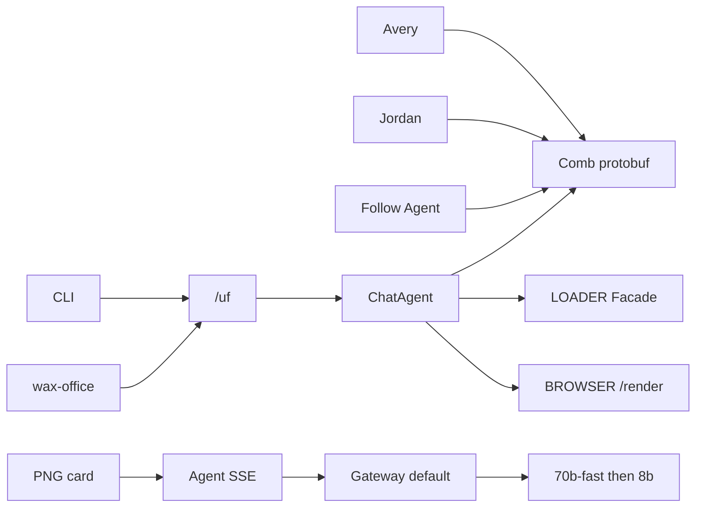

# Production AI + Realtime Collaboration Demo

> **For agentic workers:** REQUIRED SUB-SKILL: `superpowers:subagent-driven-development` + TDD. Wave 0 (T0) parallel with Wave A (T1+T2). T3 waits on T1 (`dsh-host.ts`). Wave C after T1+T2+T3. Wave E `/uf` waits on T10 releasing `dsh-host.ts`, T2 releasing `server.ts`, T0 decoded formula/exchange/print. Wave F wow waits on T5+T6+T13e. T9 last. Steps use `- [ ]`.
>
> **Save on execute:** copy to [univer-workspace/docs/superpowers/plans/2026-09-11-production-ai-collab-demo.md](univer-workspace/docs/superpowers/plans/2026-09-11-production-ai-collab-demo.md). Ledger: [univer-workspace/.superpowers/sdd/progress.md](univer-workspace/.superpowers/sdd/progress.md).
>
> **Revision:** CLI/headless is **on Cloudflare** (agent-think-cordis wax-office `/uf/` contract). Decode every Pro package before editing. Tasks 1–10 restored in full (not “unchanged intent”). T13 split. Wave F adds follow-agent, what-if, screenshot cards, formula inspector, @agent, undo.

**Goal:** [https://univer-workspace.apisos.workers.dev](https://univer-workspace.apisos.workers.dev) is a **pixel-perfect production demo**: Avery + Jordan + Workspace Agent live-edit a Q3 Forecast sheet; DSH/CLI execute/inspect/screenshot/import/export/lint/pdf run **on this Worker**; every beat is live-proved.

**Architecture:** ChatAgent `idFromName("univer_collab")` is the Univer DO. Browser uses Comb protobuf. Agent is Comb member `agent_workspace`. DSH wax-office and `univer-workspace-cli` are thin HTTP clients of `/uf/:fileKey/...`. Execute uses LOADER (or BROWSER `page.evaluate`); screenshot/pdf/lint use `env.BROWSER` + `/render`. Pro `lib/es` is deobfuscated then workerd-adapted. Merge is human. No ComputerAgent containers, no third-party LLM keys.



**Tech stack:** Workers + DO + D1 + R2 + Workers AI + AI Gateway `default` + Browser Rendering + WorkerLoader, Univer Pro `1.0.0-insiders.20260907-70fc579`, `@univerjs-pro/live-share` same pin, React 19 Browser, Cordis 4.0.2, pnpm 11.

## Do not redo

Prior plan wired Skills, HTTP turns, snapshot/changeset HTTP, Worktree clone/merge, `enableOfflineEditing: false`. Presets already registered: sheets advanced, CF, thread comment, notes, history UI, collaboration client UI, [collaborator-avatars.tsx](univer-workspace/apps/workspace/web/src/features/editor/collaborator-avatars.tsx) **exists**. Dark-mode sync exists.

## Out of scope

- Two Univer canvases in one tab
- Confetti, sound, particle overlays, canvas coach overlay
- Docs/Slides as the hero (sheet is the demo)
- `gpt-oss-120b` on the live path
- ComputerAgent Docker, Design Studio copy, BYOK
- Channel 1 mux OT, fake agent Comb ticket, AI Gateway WebSockets
- Importing `collaboration-transport-node` or `exchange-node-binding` into workerd
- Changing CLI `DEFAULT_ORIGIN` (`workspace.univer.plus`) except README fork notes

## Global constraints

- Branch `feat/cloudflare-edge-microkernel` only. Product git: `univer-workspace/`.
- Subagents: **`model: "cursor-grok-4.6-xhigh"` only.** No `fast`.
- Decode first: [scripts/deobfuscate-univer-pro.mjs](univer-workspace/scripts/deobfuscate-univer-pro.mjs). Patch `vendor/univer-pro/<pkg>/lib/es/**` or `dist/*.mjs`. Never `umd/`, never pnpm store, never `_0x` blobs. Re-run after `pnpm install`.
- Comb: `HELLO=1 JOIN=2 LEAVE=3 INGEST=4 HEARTBEAT=5 RECV=6`, `CmdRspCode.OK=1`. Unknown INGEST `eventID` broadcast as-is.
- Gateway `id: "default"`, account `e4a1e871f7728c7d65d6da135db01658`. Metadata **≤5 keys**: `product`, `unitId`, `turnId`, `actorUserId`, `step`.
- Tools: `stream: false`, `skipCache: true`. Final text: `stream: true` **without** `tools`. Explain Q3: `skipCache: false`, `cacheKey: "demo:explain-q3"`, `cacheTtl: 3600`.
- Models: `@cf/meta/llama-3.3-70b-instruct-fp8-fast` then `@cf/meta/llama-3.1-8b-instruct`.
- `AGENT_MEMBER_ID = AGENT_USER_ID = "agent_workspace"`. Gateway `actorUserId` = prompting human.
- One in-flight turn per `unitId`. After Comb SYNCED, **no** local `setValue` in [apply-agent-edits.ts](univer-workspace/apps/workspace/web/src/features/editor/apply-agent-edits.ts).
- `enableOfflineEditing: false`. `loadSheetAsync` only.
- Live: `https://univer-workspace.apisos.workers.dev`. Avery `admin`/`password123`. Jordan `jordan`/`password123`.
- `dsh-host.ts` sequential: T1 → T3 → T10 → T13b. `server.ts`: T2 owns `Env.AI` + `/healthz.ai`; T13a adds BROWSER/LOADER + `/uf` forward after T2.
- [catalog.ts](univer-workspace/src/kernel/catalog.ts) unfrozen **only** for T13g.
- Conventional Commits. Do not weaken tests. Exclusive ownership: BLOCKED if you do not own the file.
- Reduced motion: `prefers-reduced-motion: reduce` skips spotlight walk (chip only).

### Exclusive ownership (locks)

- **T0:** deobfuscate script `DEFAULT_PACKAGES`, `vendor/univer-pro/**` decode trees, vendor README. No behavior patches.
- **T1:** create [univer-comb-codec.ts](univer-workspace/src/integrations/univer-comb-codec.ts), Comb in [dsh-host.ts](univer-workspace/src/project/dsh-host.ts), [univer-comb-codec.test.ts](univer-workspace/test/univer-comb-codec.test.ts). Optional decoded `collaboration-client` socket after T0.
- **T2:** [univer-agent.ts](univer-workspace/src/plugins/univer-agent.ts), `server.ts` AI/`healthz.ai` only, agent tests, [edge-deploy-contract.test.ts](univer-workspace/test/edge-deploy-contract.test.ts) AI assertions only.
- **T3:** broadcast/cursor/roster in `dsh-host.ts`; `clientId` in agent `executeTool`; apply-agent-edits; collab tests.
- **T4:** [schema.ts](univer-workspace/src/control-plane/schema.ts), create [univer-demo-snapshot.ts](univer-workspace/src/plugins/univer-demo-snapshot.ts), [demo-seed.test.ts](univer-workspace/test/demo-seed.test.ts). Name **`ensureDemoData`**. Skip if any A1:E4 non-empty.
- **T5:** agent-collaborator, agent-panel, create agent-edit-spotlight, i18n, tests.
- **T6:** workspace `package.json` live-share, collaboration-editor, sheet-presets, create live-share-bar + collab-conflict-toast.
- **T7:** snapshot-comparison-view, worktree-review-panel; import comparison `styles.css` **in the view**.
- **T8a:** layout, login, create demo routes/stage/playbook/palette/scenes. **Do not** autofill password.
- **T8b:** collaborator-avatars (**edit**), presence-legend, history names, remaining i18n.
- **T10:** create univer-comment-http.ts; comment + user/list in univer-collab-http.ts. Decoded comment Pro after T0.
- **T11:** control-plane `/api/auth/cli/*` only.
- **T12:** [univer-snapshot.ts](univer-workspace/src/plugins/univer-snapshot.ts) + decoded collab-service apply.
- **T13a:** [wrangler.jsonc](univer-workspace/wrangler.jsonc) browser/loader/`/uf` in `run_worker_first`; Env types; deploy-contract bindings (after T2).
- **T13b:** create [univer-file-http.ts](univer-workspace/src/integrations/univer-file-http.ts) + `dsh-host` `/uf` dispatch + `server.ts` `/uf` forward.
- **T13c:** inspect handlers + tests.
- **T13d:** execute + render-evaluate/LOADER; depends T12 + T13e page stub.
- **T13e:** create render entry + screenshot/pdf/lint.
- **T13f:** import/export/svg + R2.
- **T13g:** create [univer-file.ts](univer-workspace/src/plugins/univer-file.ts) + catalog row.
- **T14:** client-core HTTP, [cli-edge-proof.mjs](univer-workspace/scripts/cli-edge-proof.mjs).
- **T15–T22:** files named in those tasks; do not take `dsh-host.ts` except T20 ticker if feed already exists (prefer header-only).
- **T9:** edge-smoke, runbook, deploy.

Do not expand [worker-gateway.test.ts](univer-workspace/test/worker-gateway.test.ts) except `/uf` forward cases owned by T13b.

## `/uf/` contract (WaxGatewayClient)

Source of truth: [agent-think-cordis wax-office/client.ts](/home/gabriel/Documentos/agent-think-cordis/src/plugins/wax-office/client.ts). `fileKey` = base64url of a path. Demo: `workspace.univer` → Space holding `unit_welcome_sheet`.

Export `fileKeyOf` / `spaceIdFromFileKey` in univer-file-http.ts:

```ts
export function spaceIdFromFileKey(key: string): string {
  const path = atob(key.replace(/-/g, "+").replace(/_/g, "/"));
  return `space_uf_${[...new Uint8Array(new TextEncoder().encode(path))]
    .map((b) => b.toString(16).padStart(2, "0"))
    .join("")
    .slice(0, 24)}`;
}
```

Routes (auth = `workspace_session` or CLI token; 401 otherwise):

- `POST /uf/:key` ensure Space
- `GET /uf/:key/units`
- `POST /uf/:key/universer-api/snapshot/:type/unit/-/create`
- `GET|POST /uf/:key/worktrees`
- `GET|POST /uf/:key/worktrees/:id/units`
- `POST /uf/:key/worktrees/:id/units/:unitId/remove`
- `POST /uf/:key/worktrees/:id/{ready|reopen|merge|discard}`
- `GET /uf/:key/worktrees/:id/preview`
- `GET /uf/:key/units/:unitId/inspect?range=&worktreeId=`
- `POST /uf/:key/worktrees/:wt/units/:unitId/execute` `{ code }`
- `POST /uf/:key/import` `{ format, content, worktreeId? }`
- `POST /uf/:key/export` `{ unitId, format, worktreeId? }`
- `POST /uf/:key/lint` `{ unitId, worktreeId? }`
- `POST /uf/:key/screenshot` `{ unitId, params? }` → `{ images: [{ mediaType: "image/png", data, width, height }] }`
- `POST /uf/:key/print-pdf`
- `POST /uf/:key/compile-svg` `{ unitId, svg }`
- `GET /resources?q=`

## CF runtimes (do not invent Node daemons)

- **inspect:** DO snapshot (`getSheetRange`). Calculated `v` only after execute persisted `{ f, v }`.
- **execute:** Facade in LOADER worker (`nodejs_compat` + decoded presets) **or** BROWSER `page.evaluate` on `/render`. Commit via collab `applyChangeset`. `memberId` = caller (CLI human) unless Agent invoked the tool (`agent_workspace`).
- **screenshot/pdf/lint:** `env.BROWSER` loads `/render?unitId=&worktreeId=&theme=`. CDP capture. R2 + data URI.
- **import/export:** decoded `exchange-client` inside BROWSER. Bytes R2.
- **compile-svg:** pure JS in DO (DSH `compileSvg`).
- **formula:** `api.getFormula().executeCalculation()` in that Univer instance; persist `{ f, v }`.

Wrangler (T13a):

```jsonc
"browser": { "binding": "BROWSER", "remote": true },
"worker_loaders": [{ "binding": "LOADER" }]
```

`cpu_ms: 300000` and `nodejs_compat` already exist.

---

### T0: Deobfuscate Pro for Cloudflare

**Files:** [deobfuscate-univer-pro.mjs](univer-workspace/scripts/deobfuscate-univer-pro.mjs), [vendor/univer-pro/README.md](univer-workspace/vendor/univer-pro/README.md), vendor trees.

**Produces:** readable `vendor/univer-pro/<pkg>/lib/es` for the CF set. No OT/formula behavior change yet.

CF set: `collaboration`, `collaboration-client`, `collaboration-client-ui`, `collaboration-endpoint`, `collaboration-service`, `collaboration-database-sqlite`, `collaboration-worktree-client`, `collaboration-worktree-endpoint`, `collaboration-worktree-service`, `collaboration-worktree-database-sqlite`, `collaboration-comment-endpoint`, `collaboration-comment-service`, `collaboration-comment-database-sqlite`, `collaboration-history-endpoint`, `collaboration-history-service`, `collaboration-history-database-sqlite`, `thread-comment-datasource`, `sheets-history`, `sheets-history-ui`, `docs-history`, `docs-history-ui`, `edit-history`, `edit-history-ui`, `live-share`, `engine-formula`, `exchange-client`, `docs-exchange-client`, `slides-exchange-client`, `bases-exchange-client`, `exchange-node`, `sheets-print`, `docs-print`, `slides-print`, `boards-print`, `license`. Decode `collaboration-transport-node` to **read** only.

Do **not** vendor-apply rust-binding or `exchange-node-binding` into the Worker.

- [ ] Failing test: `DEFAULT_PACKAGES` includes `engine-formula` and `exchange-client` (extend [deobfuscate-univer-pro.test.mjs](univer-workspace/scripts/deobfuscate-univer-pro.test.mjs)).
- [ ] Expand `DEFAULT_PACKAGES`; run `node scripts/deobfuscate-univer-pro.mjs` then `--fix-vendor`.
- [ ] Assert no glued `returnawait` in `vendor/univer-pro/engine-formula/lib/es` (or skip file with comment if decoder cannot; then fix decoder — do not patch CJS).
- [ ] README: decode → edit vendor → apply → never published.
- [ ] Commit `chore(vendor): deobfuscate Univer Pro packages needed on Cloudflare`

Workerd adaptations happen in T1/T10/T12/T13d–f: swap `better-sqlite3`/`worker_threads`/`node:fs` for DO SQL / D1 / R2; hydrate `cellData`; JS formula; exchange/print in BROWSER.

---

### T1: Comb protobuf + INGEST

**Produces:** `decodeCombFrame(bytes | string)`, `encodeCombFrame(msg) → Uint8Array`, `encodeCombJson(msg) → string`.

- [ ] Failing tests: HELLO/JOIN/RECV `users_enter` / `new_changesets` binary roundtrip; JSON still decodes; opaque `eventID: "live_share"` INGEST RECV-broadcast to second fake socket.
- [ ] Codec via `@univerjs/protocol` (inspect node_modules; do not invent field numbers).
- [ ] Dual-path `webSocketMessage`: `ArrayBuffer` → protobuf; JSON `cmd` stays JSON unless `att.wire === "protobuf"`. Set `att.wire` on first binary frame.
- [ ] INGEST: `update_cursor` current shape; **any other eventID** RECV as-is.
- [ ] Commit `feat(collab): speak official protobuf Comb and pass through Live Share INGEST`

---

### T2: AI Gateway + live SSE

Widen `Env.AI` / `AgentHost.env` to 3-arg `run`. Prefer `wrangler types` `Ai`.

```ts
export const AI_GATEWAY_ID = "default";
export const AI_GATEWAY_LIVE_MODELS = [
  "@cf/meta/llama-3.3-70b-instruct-fp8-fast",
  "@cf/meta/llama-3.1-8b-instruct",
] as const;
```

`emit()` is a **live sink** (SSE write / mux send), not fill-then-dump.

- [ ] Tests: `gateway.id === "default"`; tool still writes; **final** `run` has `stream: true` and **no** `tools`; mock SSE `data: {"response":"Hel"}\n\n`; tokens Hel/lo; explain uses `skipCache: false` + `cacheKey: "demo:explain-q3"`; tools `skipCache: true`; `/healthz.ai.gateway === "default"`.
- [ ] Metadata 5 keys, `step: "tool" | "text" | "explain"`.
- [ ] `Accept: text/event-stream` writes immediately; JSON default for CLI.
- [ ] Mux: `muxFrame` **per emit**. `{ ch: 2, channel: 2, type, data }`.
- [ ] Busy lock per `unitId` → `agent.error` “Agent is busy”.
- [ ] Snapshot `aiGatewayLogId` onto `agent.done`.
- [ ] Commit `feat(agent): route inference through AI Gateway default with live SSE`

---

### T3: Agent Comb peer

**Depends on T1.** Identity: `userID = memberID = "agent_workspace"`, `name = "Workspace Agent"`. **No ticket.**

- [ ] `getRoomMembers` appends agent when room has ≥1 human. JOIN `joinRsp` includes it. Broadcast `users_enter` on first JOIN.
- [ ] Sheet writes `clientId: AGENT_MEMBER_ID`.
- [ ] Each `setRange`: Comb `update_cursor` (A1 → row/col) **then** `new_changesets`. Encode per `att.wire`.
- [ ] `applyWorkspaceAgentEdits`: if `SYNCED`, do not `setValue`; return `{ applied: false, ranges }`.
- [ ] Test: second member gets `users_enter` + `update_cursor` + `new_changesets` (`sheet.mutation.set-range-values`).
- [ ] Skip `users_leave` if it races the demo.
- [ ] Commit `feat(collab): show Workspace Agent as a Comb collaborator with cursor`

---

### T4: Q3 Forecast seed

**Ids locked:** `user_admin` Avery Chen; `user_jordan` Jordan Lee `editor` on `space_personal_admin`; `node_welcome_sheet` / `unit_welcome_sheet`. Rename node **Q3 Forecast**.

Bake into `originalMeta` (not live Facade after load):

- Sheet `Forecast`
- Header `Metric | Jul | Aug | Sep | Q3`
- B2:D4 sample numbers; **E2:E4 empty** (Agent fill beat) with color scale already on E2:E4
- Sparklines F2:F4 from `B2:D2`…
- Column chart `A1:D4` below table
- Named range `Sep` = `D2:D4`
- Data validation 0–999 on `D2:D4`

`ensureDemoData(db)`: idempotent; add Jordan; **do not apply snapshot if any A1:E4 non-empty**.

- [ ] Tests: two users; no dup; snapshot has CF or chart drawing; named range `Sep`.
- [ ] Commit `feat(demo): seed Avery, Jordan, and a charted Q3 Forecast`

---

### T5: Agent panel stream + spotlight

- [ ] SSE client (`Accept: text/event-stream`); JSON fallback.
- [ ] `aria-live="polite"`; `aria-busy`; tool chips; tokens.
- [ ] Footer: `Cloudflare AI Gateway` + `cache: HIT|MISS` + truncated `aiGatewayLogId`.
- [ ] Chips: `Fill E2:E4 with SUM of Jul–Sep`, `Explain the Q3 forecast in one sentence`, `Set D4 to 180`. Header title `Q3 Forecast` (hide unit id).
- [ ] Spotlight: `workspace-agent-edited` → `activate()` E2→E4 once (`sessionStorage` `univer-workspace-agent-replay-v1`). Replay button. Compact 720 **and** `prefers-reduced-motion`: chip only.
- [ ] Dispatch `workspace-agent-presence` `{ status: "thinking" | "idle" }`.
- [ ] Spectator mux listen-only; never send `agent.prompt` from spectators.
- [ ] i18n: `agentGateway`, `agentCacheHit`, `agentCacheMiss`, `agentChangedCells`, `agentReplay`, `agentChipFillQ3`, `agentIntro`.
- [ ] Commit `feat(web): stream Gateway turns with cell spotlight`

---

### T6: Live Share + conflict

- [ ] `@univerjs-pro/live-share@1.0.0-insiders.20260907-70fc579` + CSS + `/facade`. Register `UniverLiveSharePlugin`. `UniverSheetsThreadCommentPreset({ collaboration: true })`.
- [ ] `live-share-bar.tsx`: Present / Stop / Follow via Facade. Hide if missing.
- [ ] `CollaborationUIEventId.CONFLICT` → Sonner warning, debounce 800ms. i18n `collabConflictToast`.
- [ ] Move custom status pill **off canvas** into node header.
- [ ] Commit `feat(web): Live Share present/follow and collab conflict toasts`

---

### T7: Native comparison viewer

- [ ] Mount `UnitComparisonViewer` / `createComparisonUniver`.
- [ ] Import `@univer/unit-comparison-viewer/styles.css` **in the view file** (not `global.css`).
- [ ] `left.label` / `right.label` (`officialVersion` / `agentVersion`).
- [ ] HTML table fallback if factory throws.
- [ ] Commit `feat(web): native Worktree unit comparison`

---

### T8a: `/demo` stage + scenes + palette

**Do not** fill password. **Do not** overlay coach on the grid.

- [ ] Routes `/demo`, `/demo?as=jordan`, `/demo?lang=zh-CN`, `/demo?play=1`, `/demo?scene=fill|conflict|review|export`. Silent POST login → `/nodes/node_welcome_sheet?play=1`. Hide Create account on this origin.
- [ ] Header stepper `h-9`: Open Jordan → Edit a cell → Ask Agent Fill → Present/Follow → Worktree Ready/Compare/Merge. `localStorage` `univer-workspace-demo-playbook-v2`. Compact: `Demo` badge only. Keys `j`/`n` advance step when playbook focused.
- [ ] Scenes: `fill` focuses Fill chip; `conflict` copies Jordan URL + toast `collabSameCell`; `review` opens worktree panel; `export` opens palette export.
- [ ] ⌘K palette: Avery/Jordan links, Fill SUM, Explain Q3, Present, Follow Agent (T15), What-if (T18), Export xlsx (T13f), language.
- [ ] Safe reset: other humans → `demoResetBlocked` + isolate; alone → T4 empty A1:E4 rule. No wipe endpoint.
- [ ] Commit `feat(web): presenter /demo stage, scenes, and command palette`

---

### T8b: Presence + History names

- [ ] Avatars: ring from `member.color` or hash `userID` onto tokens `brand-600`, `sheet`, `board`, `slide`, `warning`, `baseunit`. Empty: you + dashed **Waiting for Jordan** + muted Bot. Pulse on thinking. Bot icon if `userID === "agent_workspace"` or `agent:`.
- [ ] `presence-legend.tsx` popover on the stack (not a HUD on the grid).
- [ ] History map: `user_admin` → Avery Chen, `user_jordan` → Jordan Lee, `agent_workspace` → Workspace Agent. Stop `Administrator`.
- [ ] i18n: `collaborationExample` → `Humans and AI, live` / `人与 AI 实时协作`. Playbook + palette keys.
- [ ] Commit `feat(web): presence rings, ghost Jordan, and History names`

---

### T10: Comments or notes

Copy wire from `@univerjs-pro/collaboration-comment-endpoint` (decoded after T0). SQLite on ChatAgent. `/universer-api/comment/unit/:unitId/...` + `GET /universer-api/user/list` (Avery, Jordan, Agent).

- [ ] Test: comment D3, list returns it, second member sees it.
- [ ] If wire mismatches: **hide** comment chrome (no 404 button); notes fallback if OT materialize works.
- [ ] Commit `feat(collab): Universer thread comments for the Q3 demo` **or** `fix(web): hide thread comments until Universer comment routes exist`

---

### T11: CLI device-code

[auth.ts](univer-workspace/packages/client-core/src/auth.ts) already calls `POST /api/auth/cli/authorizations` and `/exchange`. SPA [cli-login.tsx](univer-workspace/apps/workspace/web/src/routes/cli-login.tsx) exists.

- [ ] Failing test: start → approve as `user_admin` → exchange cookie/token; expired 401; password-stdin still works.
- [ ] D1 `cli_authorizations (user_code, user_id, status, expires_at)`.
- [ ] No CLI poll; `--complete` one-shot.
- [ ] Commit `feat(edge): device-code CLI login against the Cloudflare origin`

---

### T12: Materialize mutations

- [ ] Failing tests from real mutation JSON: `{ v, f: "=SUM(B2:D2)" }` persists both; insert-row/col if Facade emits them; unknown id stored, snapshot not corrupted.
- [ ] Apply via **decoded** `collaboration-service` helpers, not a third mutator. Keep `projectSheetBlocks`. Patch decoded `collaboration-client` hydrate if `loadSheetAsync` drops `cellData`.
- [ ] Commit `fix(edge): apply Facade mutations onto collaborative snapshots`

---

### T13a: Bindings

- [ ] Failing `edge-deploy-contract`: `browser.binding === "BROWSER"`, `worker_loaders[0].binding === "LOADER"`, `run_worker_first` includes `/uf` and `/uf/*`.
- [ ] Implement wrangler keys; extend `Env` (`BROWSER`, `LOADER`). Do not steal T2 healthz.
- [ ] Commit `feat(edge): bind Browser Rendering and WorkerLoader`

---

### T13b: `/uf` router

- [ ] Failing tests: unauthenticated POST 401; `POST /uf/:key` then `GET .../units` 200; unknown key 404.
- [ ] `handleUniverFileHttp` + forward from `server.ts` + `dsh-host.fetch`. Map fileKey → Space (create on POST).
- [ ] Alias existing worktree product APIs under `/uf/:key/worktrees`.
- [ ] Commit `feat(edge): Univer File /uf gateway skeleton`

---

### T13c: inspect

- [ ] Failing test: seed A1, `GET .../inspect?range=A1` returns `{ v }` (or grid).
- [ ] Implement from DO snapshot. Worktree query uses draft snapshot.
- [ ] Commit `feat(edge): /uf inspect from collaborative snapshots`

---

### T13d: execute

**Depends on T12 + `/render` stub from T13e.**

- [ ] Failing test: POST `{ code: "api.getActiveWorkbook().getActiveSheet().getRange('E2').setValue({ f: '=SUM(B2:D2)' });" }` → inspect shows `f` and/or `v`. Fake BROWSER/LOADER in unit tests.
- [ ] Real Facade (LOADER or `page.evaluate`). Persist changeset. Formula `executeCalculation()`.
- [ ] Writes use caller memberId (not agent) for CLI.
- [ ] Commit `feat(edge): /uf execute Facade on Cloudflare`

---

### T13e: render + screenshot/pdf/lint

**Files:** create `apps/workspace/web/src/render-main.tsx` (minimal Univer boot, no chrome), Vite entry, asset `/render`.

- [ ] Failing tests: fake BROWSER `Page.captureScreenshot` → PNG length > 0; missing BROWSER → 503 `{ error: "BROWSER unbound" }` (never fake pixels).
- [ ] `/render?unitId=&worktreeId=&theme=` loads snapshot, exposes `window.univerAPI`.
- [ ] screenshot / print-pdf / lint routes.
- [ ] Commit `feat(edge): Browser Rendering screenshots and print-pdf`

---

### T13f: exchange + svg

- [ ] Failing tests: import tiny csv → unit exists; export `csv` returns bytes; svg compile mutates snapshot.
- [ ] Decoded `exchange-client` in BROWSER; R2 for blobs. No `exchange-node-binding`.
- [ ] Commit `feat(edge): /uf import export and compile-svg on Cloudflare`

---

### T13g: Cordis `univer_*` tools

- [ ] Catalog plugin `univer-file`. Tools: `univer_execute`, `univer_inspect`, `univer_screenshot`, `univer_import`, `univer_export`, `univer_lint`, `univer_print_pdf`, `univer_compile_svg`, `univer_worktree`, `univer_unit` — same names as wax-office.
- [ ] Agent turns may call `univer_execute` (not only regex `Set A1`). Regex remains fallback.
- [ ] Commit `feat(agent): DSH office tools on ChatAgent`

---

### T14: Thin CLI proof

CLI execute/inspect/screenshot/import/export against `EDGE_ORIGIN` **must** hit `/uf/`. Local Chromium not required for exit 0.

- [ ] `scripts/cli-edge-proof.mjs` live-true: login, whoami, space list, execute SUM E2, inspect E2, screenshot PNG>0, worktree ready, curl `/uf` with cookie.
- [ ] `live-edit.mjs --origin ... --set E4=180` then Agent Fill.
- [ ] README Edge Quick Start.
- [ ] Commit `test(cli): prove /uf execute inspect screenshot on Cloudflare`

---

### T15: Follow Workspace Agent

**Depends on T3 + T6.**

- [ ] When presence is `thinking` or agent `update_cursor`, Follow targets `agent_workspace` (not Avery) if user chose **Follow Agent**.
- [ ] Palette + Live Share bar button `Follow Agent`. i18n `followAgent`.
- [ ] Test: mock status + member id.
- [ ] Commit `feat(web): follow the Workspace Agent viewport`

---

### T16: Explain this selection

- [ ] Chip `Explain selection`: read active range A1 from Facade; POST turn `Explain ${range} in one sentence`. Ad-hoc ranges: `skipCache: true`. Canned full-sheet sentence keeps `demo:explain-q3`.
- [ ] Empty selection → toast `selectARange`.
- [ ] Commit `feat(web): explain the current sheet selection`

---

### T17: CF screenshot card

**Depends on T13e + T5.**

- [ ] After Fill E2:E4 `tool_call_result`, `ctx.waitUntil` screenshot `A1:F12` (chart). Attach `{ screenshot: { mediaType, data } }` on `agent.done` (does not block tokens).
- [ ] Panel ``. No placeholder PNG if BROWSER fails — show `screenshotUnavailable`.
- [ ] Commit `feat(agent): attach Cloudflare screenshot after Q3 fill`

---

### T18: What-if +10% Sep

**Depends on T7 + T13d.**

- [ ] Palette **What-if +10% Sep**: create worktree, execute `D2:D4` values `* 1.1` (or formulas), `ready`, open comparison labeled Official vs What-if.
- [ ] Human merges. Busy/error toasts.
- [ ] Commit `feat(web): what-if worktree for September plus ten percent`

---

### T19: `@agent` comments

**Depends on T10 green (not notes-only hide).** If T10 hid comments, skip this task and mark cancelled in the ledger.

- [ ] Comment body matching `/@agent\b/i` enqueues the remainder as a Skill turn (same busy lock). Agent replies with a comment as `agent_workspace`.
- [ ] Test: `@agent fill E2` creates turn + reply comment.
- [ ] Commit `feat(collab): at-agent comments start a Workspace Agent turn`

---

### T20: Edge HUD + change-feed ticker

- [ ] Header strip (not on grid): Comb `protobuf|json` from last frame; Gateway last `HIT|MISS`; `BROWSER` `ok|off` from `/healthz` (`ai` + `browser`). Compact: icons only.
- [ ] Existing worktree change feed: Sonner `cliWroteCells` when `/uf` execute commits (Jordan sees CLI live).
- [ ] Commit `feat(web): edge status strip and live CLI write ticker`

---

### T21: Formula inspector

- [ ] Alt-click or palette **Inspect formula** on E2: popover `{ f, v, precedents }` from `/uf/.../inspect` or local snapshot.
- [ ] Precedents highlight B2:D2 once.
- [ ] Commit `feat(web): formula inspector for Q3 SUM cells`

---

### T22: Undo last agent turn

- [ ] Agent panel **Undo** calls `action.reverseLast()` when last journal actor is `agent_workspace`; broadcast inverse changeset on Comb.
- [ ] Disabled if last edit was human. i18n `undoAgentTurn`.
- [ ] Test: setRange then reverse restores prior `v`.
- [ ] Commit `feat(agent): reverse the last Workspace Agent turn`

---

### T9: Deploy and 90-second proof

```bash
pnpm --filter @univerjs/univer-workspace build:web
pnpm exec wrangler deploy
EDGE_ORIGIN=https://univer-workspace.apisos.workers.dev node scripts/edge-smoke.mjs
```

Smoke: `healthz.ai.gateway === "default"`; `healthz.browser` bound; Avery turn `rev`; Explain MISS then HIT; `/uf` inspect + screenshot 200.

**90-second script (required, not a screenshot):**

1. `/demo` Avery: Q3 chart, stepper 1/5, HUD Comb/Gateway, ghost Jordan.
2. `/demo?as=jordan` private window: Avery sees Jordan cursor + avatar.
3. Avery D3=180; Jordan chart/sparkline move; no reload.
4. Same cell conflict toast (both type D3).
5. Avery Present; Jordan Follow; Avery scrolls to chart.
6. Follow Agent; Fill E2:E4; tokens stream; bot `users_enter`; Jordan sees SUM; spotlight E2:E4; screenshot card; HUD HIT on second Explain.
7. History: Avery / Jordan / Workspace Agent. Undo agent once, redo via Fill.
8. What-if +10% Sep → Compare native viewer → Merge.
9. Formula inspector on E2. Optional @agent comment.
10. CLI proof from T14 against the same origin.

Check runbook only after real clicks. Commit `test(edge): smoke AI Gateway two-user demo and /uf`

## Waves

- Wave 0: T0
- Wave A: T1 ∥ T2
- Wave B: T3
- Wave C: T4 ∥ T5 ∥ T6 ∥ T7 ∥ T8a ∥ T8b ∥ T10
- Wave E: T11 ∥ T12; then T13a; T13b; T13c ∥ T13e; T13d (after T12+T13e); T13f; T13g; T14
- Wave F: T15 ∥ T16 ∥ T21; T17 after T13e; T18 after T13d+T7; T19 after T10; T20; T22 after T3
- Wave D: T9 + whole-branch review `cursor-grok-4.6-xhigh` + finishing-a-development-branch

Controller: SDD task briefs + `scripts/review-package`. Never `HEAD~1`.

## Self-review

- Spec coverage: Comb, Gateway, agent peer, visual Q3, SSE, Live Share, comparison, /demo, comments, CLI auth, mutations, /uf split, Pro decode, follow-agent, explain selection, screenshot card, what-if, @agent, HUD, formula inspector, undo, 90s proof.
- Retracted: Node-only headless; “Tasks 1–10 unchanged”; XLSX/screenshot out of Worker scope.
- Types: 3-arg `run`, `AGENT_MEMBER_ID`, Gateway 5 keys, `Env.BROWSER`/`LOADER`, `/uf` screenshot `{ images: [{ mediaType, data }] }`.
- No placeholders. Exclusive locks prevent two writers on `dsh-host.ts`.
